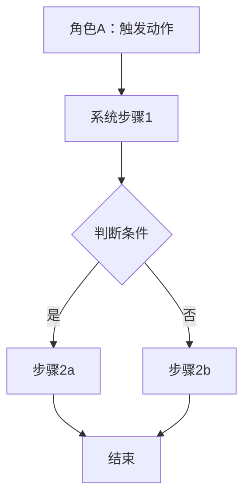
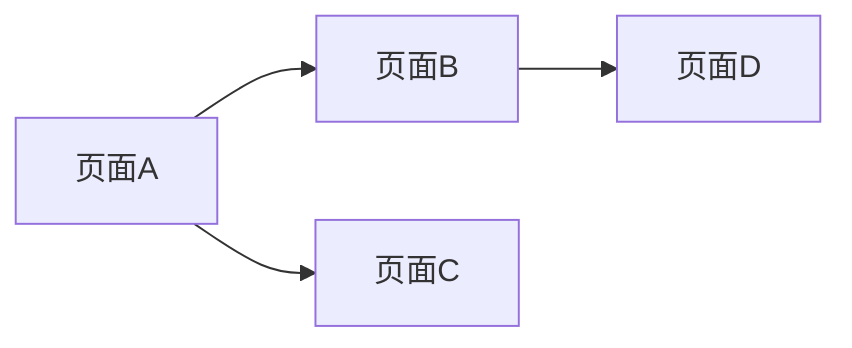

# PRD 生成

## 输入

- `{项目目录}/02-analysis-report.md`（需求分析，必需）
- `{项目目录}/03-competitor-report.md`（竞品研究，如有）
- `{项目目录}/04-user-stories.md`（用户故事，如有）
- `templates/prd-styles/{风格名}/style-config.json`（写作风格，可选）

## 输出

`{项目目录}/05-prd/05-PRD-v1.0.md`

目录结构：
```
{项目目录}/05-prd/
├── README.md
└── 05-PRD-v1.0.md
```

## 执行步骤

### 步骤1：询问导出格式（生成前确认）

**先检测** `06-prototype/screenshots/manifest.json` 是否存在，决定是否展示含截图选项。

使用 **AskUserQuestion 工具**（交互式单选），不要用纯文字输出让用户手动输入字母。

**有 manifest.json 时**，提供5个选项：
- A. 仅 Markdown — 最快，无额外等待，适合版本管理和后续编辑
- B. Markdown + 纯文字 PDF（+5秒） — 干净PDF，适合快速存档或邮件发送
- C. Markdown + DOCX 含截图（+20秒） — Word格式+截图，适合上传飞书
- D. Markdown + PDF 含截图（+30秒） — 自包含PDF，适合正式评审会议分发
- E. 全套 DOCX + PDF 均含截图（+40秒） — 一次生成所有格式

**无 manifest.json 时**：只展示 A/B 两个选项，并在问题描述中提示"如需含截图版，请先运行 /ai-pm prototype"。

用户选择后记录 `$EXPORT_MODE`，继续执行步骤2。

### 步骤2：读取风格配置（可选）

检查是否有 `--style` 参数或 `$PM_STYLE` 环境变量，若有则读取对应的 `style-config.json` 并应用：
- 章节顺序（`structure.chapterOrder`）
- 优先级术语（P0/P1/P2 或 高/中/低）
- 表格字段（`formatting.tableFields`）
- 内容侧重（`contentFocus`：用户故事篇幅、指标详细程度等）

### 步骤3：读取所有输入文档，整合信息

**⚠️ 强制规则：先检查模板，再动笔**

执行前必须检查 `templates/prd-styles/default/feishu-template.md` 是否存在：
- **存在时**：先完整读取模板，PRD 的所有章节结构、字段名称、字段顺序必须**严格与模板一致**，不得凭印象自行调整
- **不存在时**：按本文件「PRD 8 章结构」生成

> 用户上传模板就是为了让输出严格对齐，任何"我觉得这样更合理"的自行调整都是错的。

**职责边界**：
- **模板文件**是内容规则的唯一来源：章节名、字段名、字段顺序、表格结构，一律以模板为准
- **本 SKILL.md** 只定义行为规则：何时读模板、用 Mermaid、不降级、版本策略等
- 本文件中出现的任何字段示例（包括「PRD 8 章结构」里的样例）仅作无模板时的兜底，**不构成对模板内容的约束**；用户修改模板后，示例自动失效，以模板为准

### 步骤4：按 8 章结构生成 PRD

```
mkdir -p {项目目录}/05-prd/
```

生成 `05-PRD-v1.0.md` 并创建 `README.md`（说明目录用途）。

### 步骤4.5：导出前敏感信息扫描

**在执行导出前**，对 PRD Markdown 源文件做正则扫描，检测以下敏感信息：

- 高危：API Key（`sk-`/`key-`/`token-` 开头）、数据库连接串、密码明文、私钥片段
- 中危：内部 IP（`192.168.*`/`10.*`）、内部域名（`.internal`/`.local`/`.corp`）、手机号、身份证号、邮箱

**如果发现敏感信息**，提示用户：

```
⚠️ 敏感信息扫描发现 {N} 处：

  🔴 L42: sk-a****xxxx（API Key）
  🟡 L78: 192.***.***.100（内部 IP）
  🟡 L103: 138****8000（手机号）

选择：
  A. 自动脱敏后导出（替换为占位符）
  B. 忽略，直接导出
  C. 我先手动修改，稍后再导出
```

- 选 A → 在导出副本中替换（API Key → `[API_KEY_REDACTED]`，手机号 → `138****8000`），原文不动
- 选 B → 直接导出
- 选 C → 暂停导出，等用户修改后重新执行

**无发现则静默通过**，不打扰用户。

**邮箱排除白名单**：`example.com`、`example.org`、`test.com`、`localhost` 等占位域名自动跳过。

### 步骤5：完成提示 + 执行导出

输出 PRD 关键摘要，然后按步骤1所选 `$EXPORT_MODE` 执行导出：

```
✅ PRD 已生成：05-prd/05-PRD-v1.0.md
   功能模块：{N} 个 | P0：{N} 项 | 核心指标：{N} 条

⏳ 正在生成 {所选格式}...
✅ {格式A} → 05-prd/05-PRD-v1.0.{ext}
✅ {格式B} → 05-prd/05-PRD-v1.0.{ext}   （全套时）
```

## PRD 8 章结构

```markdown
# {产品名}需求文档

## 一、文档概述
### 1.1 评审/修订日志
| 日期 | 修订版本 | 修改描述 | 涉及影响模块 | 作者 | 备注 |
|------|---------|---------|-------------|------|------|
| {日期} | v1.0 | 初稿创建 | - | AI_PM | - |

## 二、需求分析
### 2.1 需求背景
**需求来源**：{市场反馈 / 主动规划 / 内部优化}
**目标用户及场景**：{用户画像} + {具体场景}
**需求痛点**：{详细描述，引用需求分析报告}

### 2.2 需求价值
**定性描述**：{产品价值}
**定量指标**：
| 指标类型 | 指标名称 | 目标值 | 验收标准 |
|---------|---------|-------|---------|
**优先级**：{P0/P1/P2}

## 三、功能清单
### 3.1 主要功能说明
| 模块 | 功能 | 子功能 | 描述 | 优先级 | 备注 |
|------|------|--------|------|--------|------|
- P0：核心功能，必须实现
- P1：重要功能，建议实现
- P2：增值功能，可选实现

## 四、产品流程
### 4.1 业务流程图

**必须使用 Mermaid 语法**，导出时自动渲染为流程图图片。

**⚠️ 禁止降级**：Mermaid 渲染失败时，**必须修复渲染问题**，不得静默降级为代码块展示。降级意味着交付物缺失，不是可接受的降本方案。



### 4.2 页面流程图

**必须使用 Mermaid 语法**。



## 五、全局说明
### 5.1 名词解释
| 术语 | 解释 |
|------|------|

### 5.2 公共交互说明
{弹窗、Toast、键盘交互等全局规则}

### 5.3 统一异常处理
| 异常类型 | 触发条件 | 处理方式 | 提示文案 |
|---------|---------|---------|---------|

### 5.4 列表默认数据与分页
{默认排序、空状态、分页规则}

## 六、详细功能设计
### 6.1 {功能名称}
| 项目 | 说明 |
|------|------|
| **用户场景** | {场景描述} |
| **功能描述** | {功能描述} |
| **原型图** | [{功能名称}原型] {核心布局要素简述，如"顶部导航+列表区+底部操作栏"} |
| **优先级** | P0/P1/P2 |
| **输入/前置条件** | {前置条件} |
| **需求描述（基本事件流）** | {步骤列表} |
| **需求描述（异常事件流）** | {异常处理} |
| **输出/后置条件** | {后置条件} |
| **用户权限** | {哪些角色可用} |
| **补充说明** | {其他注意事项} |

## 七、效果验证
### 7.1 指标及定义
| 指标分类 | 指标名称 | 定义 | 计算方式 | 目标值 |
|---------|---------|-----|---------|-------|

### 7.2 数据埋点
| 埋点事件 | 触发时机 | 事件参数 | 备注 |
|---------|---------|---------|------|
事件命名规范：{module}_{action}_{object}

## 八、非功能性说明
### 8.1 性能需求
| 指标 | 要求 |
|------|------|
| 页面加载 | < 2s |
| 接口响应 | < 500ms |

### 8.2 兼容性
{浏览器/设备要求}

### 8.3 安全需求
{数据加密、权限控制、合规要求}

### 8.4 未来规划
| 版本 | 规划功能 | 预计时间 |
|------|---------|---------|
```

## 版本策略

- 首次生成：创建 v1.0，修订日志记录"初稿创建"
- 评审后修改：**不创建新文件**，在原文档直接修改，修订日志追加新记录（v1.1、v1.2...）
- 不生成 `.bak` 备份文件，Git 历史已足够

## 导出格式参考

| 选项 | 产物文件 | 命令（独立触发时） |
|------|---------|----------------|
| A 仅 Markdown | `05-PRD-v1.0.md` | 默认 |
| B 纯文字 PDF | `05-PRD-v1.0.pdf` | `--export=pdf` |
| C DOCX 含截图 | `05-PRD-v1.0.docx` | `--export=docx` |
| D PDF 含截图 | `05-PRD-v1.0-illustrated.pdf` | `--export=pdf-illustrated` |
| E 全套 | DOCX + 两个 PDF | `--export=all` |

### PDF 导出实现

**依赖**：Node.js（已内置）+ 系统 Chromium（`~/Library/Caches/ms-playwright/chromium-1212/`）

**三条路径共用的 HTML 构建逻辑**：

```bash
CHROME=~/Library/Caches/ms-playwright/chromium-1212/chrome-mac-arm64/"Google Chrome for Testing.app"/Contents/MacOS/"Google Chrome for Testing"
PRD_DIR="{项目目录}/05-prd"
PROTO_DIR="{项目目录}/06-prototype"
CSS_PATH="templates/prd-styles/default/pdf-style.css"
SKILL_DIR=".claude/skills/ai-pm-prd"
```

**含图片路径（B/C/D/E）的 Mermaid 预处理**（在 HTML 构建之前执行）：

```bash
# 预渲染 Mermaid 流程图 → 生成临时 MD（mermaid 块替换为 base64 ）
python3 "$SKILL_DIR/preprocess_mermaid.py" \
  "{项目目录}/05-prd/05-PRD-v1.0.md" \
  "{项目目录}/05-prd/_tmp_preprocessed.md"

# 后续 HTML 构建使用 _tmp_preprocessed.md 而非原始 MD
# 最终清理：rm "{项目目录}/05-prd/_tmp_preprocessed.md"
```

```javascript
// build-pdf-html.js（通用 HTML 构建，withPrototype 参数控制是否嵌图）
const fs = require('fs'), path = require('path');

function buildHtml(prdPath, cssPath, withPrototype = false) {
  let md = fs.readFileSync(prdPath, 'utf8');
  const css = fs.readFileSync(cssPath, 'utf8');
  const projectDir = path.resolve(path.dirname(prdPath), '..');

  // 若嵌入原型截图：读 manifest，将 [xxx原型] 替换为 base64 
  if (withPrototype) {
    const manifestPath = path.join(projectDir, '06-prototype/screenshots/manifest.json');
    if (fs.existsSync(manifestPath)) {
      const manifest = JSON.parse(fs.readFileSync(manifestPath, 'utf8'));
      manifest.sections.forEach(section => {
        const placeholder = '[' + section.label + '原型]';
        const screenshotPath = path.join(projectDir, '06-prototype', section.screenshot);
        if (fs.existsSync(screenshotPath)) {
          const b64 = fs.readFileSync(screenshotPath).toString('base64');
          const imgTag = '<figure class="prototype-figure">'
            + ''
            + '<figcaption style="text-align:center;font-size:9pt;color:#86868b;margin-top:4pt;">'
            + section.label + '</figcaption></figure>';
          md = md.split(placeholder).join(imgTag);
        }
      });
    }
  }

  // Markdown → HTML（标题/表格/列表/粗体/代码）
  let html = md
    .replace(/^#### (.+)$/gm, '<h4>$1</h4>')
    .replace(/^### (.+)$/gm, '<h3>$1</h3>')
    .replace(/^## (.+)$/gm, '<h2>$1</h2>')
    .replace(/^# (.+)$/gm, '<h1>$1</h1>')
    .replace(/\*\*(.+?)\*\*/g, '<strong>$1</strong>')
    .replace(/`(.+?)`/g, '<code>$1</code>')
    .replace(/^---$/gm, '<hr>')
    .replace(/^- (.+)$/gm, '<li>$1</li>')
    .replace(/(<li>[^]*?<\/li>\n?)+/g, s => '<ul>' + s + '</ul>');

  html = html.split('\n\n').map(block => {
    if (block.match(/^<(h[1-4]|ul|hr|pre|figure)/)) return block;
    if (block.trim().startsWith('|')) return convertTable(block);
    return '<p>' + block + '</p>';
  }).join('\n');

  function convertTable(block) {
    const rows = block.trim().split('\n').filter(r => !r.match(/^\|[-| :]+\|$/));
    if (!rows.length) return block;
    const cells = r => r.split('|').slice(1, -1).map(c => c.trim());
    const header = cells(rows[0]).map(c => '<th>' + c + '</th>').join('');
    const body = rows.slice(1).map(r =>
      '<tr>' + cells(r).map(c => '<td>' + c + '</td>').join('') + '</tr>'
    ).join('');
    return '<table><thead><tr>' + header + '</tr></thead><tbody>' + body + '</tbody></table>';
  }

  return '<!DOCTYPE html><html lang="zh-CN"><head><meta charset="UTF-8">'
    + '<style>' + css + '</style></head><body>' + html + '</body></html>';
}

module.exports = { buildHtml };
```

---

#### 路径 A：纯文字版（5 秒）

> 不含原型截图，Mermaid 不预处理（保持代码块原样）。

```bash
node -e "
const { buildHtml } = require('./build-pdf-html.js');
const fs = require('fs');
const html = buildHtml(
  '{项目目录}/05-prd/05-PRD-v1.0.md',
  'templates/prd-styles/default/pdf-style.css',
  false   // ← 不嵌图
);
fs.writeFileSync('{项目目录}/05-prd/_tmp.html', html);
"
"$CHROME" --headless=new --no-sandbox --disable-gpu \
  --print-to-pdf="{项目目录}/05-prd/05-PRD-v1.0.pdf" \
  --print-to-pdf-no-header \
  "file://{项目目录}/05-prd/_tmp.html" 2>/dev/null
rm "{项目目录}/05-prd/_tmp.html"
```

#### 路径 B：含原型截图 + 流程图版（30-40 秒）

> 先执行 Mermaid 预处理，再构建 HTML（使用 `_tmp_preprocessed.md`）。

```bash
# 1. Mermaid 预处理
python3 "$SKILL_DIR/preprocess_mermaid.py" \
  "{项目目录}/05-prd/05-PRD-v1.0.md" \
  "{项目目录}/05-prd/_tmp_preprocessed.md"

# 2. 构建 HTML（用预处理后的 MD）
node -e "
const { buildHtml } = require('./build-pdf-html.js');
const fs = require('fs');
const html = buildHtml(
  '{项目目录}/05-prd/_tmp_preprocessed.md',
  'templates/prd-styles/default/pdf-style.css',
  true    // ← 嵌入原型截图
);
fs.writeFileSync('{项目目录}/05-prd/_tmp_illustrated.html', html);
"

# 3. 打印 PDF
"$CHROME" --headless=new --no-sandbox --disable-gpu \
  --print-to-pdf="{项目目录}/05-prd/05-PRD-v1.0-illustrated.pdf" \
  --print-to-pdf-no-header \
  "file://{项目目录}/05-prd/_tmp_illustrated.html" 2>/dev/null

# 4. 清理临时文件
rm "{项目目录}/05-prd/_tmp_illustrated.html"
rm "{项目目录}/05-prd/_tmp_preprocessed.md"
```

#### 路径 C：先文字版，后截图版

先执行路径 A，告知用户纯文字 PDF 已就绪，再执行路径 B，完成后告知 illustrated 版本路径。

```
✅ 纯文字版已生成：05-prd/05-PRD-v1.0.pdf
⏳ 正在生成带原型截图版，请稍候...
✅ 截图版已生成：05-prd/05-PRD-v1.0-illustrated.pdf
```

---

**产物命名约定**：

| 文件 | 说明 |
|------|------|
| `05-PRD-v1.0.pdf` | 纯文字版（路径 A/C） |
| `05-PRD-v1.0-illustrated.pdf` | 含原型截图版（路径 B/C） |

---

#### 路径 C：DOCX 含截图（约 20 秒）

```bash
SKILL_DIR=".claude/skills/ai-pm-prd"
python3 "$SKILL_DIR/md2docx.py" \
  "{项目目录}/05-prd/05-PRD-v1.0.md" \
  "{项目目录}/05-prd/05-PRD-v1.0.docx" \
  "{项目目录}/06-prototype/screenshots/manifest.json"
```

**依赖**：`python-docx`（`python3 -m pip install python-docx`）。首次使用时自动安装，后续复用。

**飞书导入方式**：飞书「新建文档」→「导入」→ 选择 `.docx` 文件，飞书自动转为可编辑云文档，截图保留在对应章节。

---

**产物命名约定**：

| 文件 | 说明 |
|------|------|
| `05-PRD-v1.0.pdf` | 纯文字 PDF（路径 B） |
| `05-PRD-v1.0.docx` | 含截图 DOCX，用于飞书导入（路径 C） |
| `05-PRD-v1.0-illustrated.pdf` | 含截图 PDF，自包含（路径 D） |
