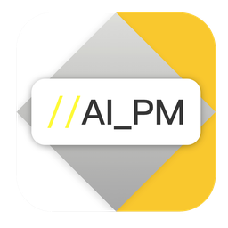

<p align="center">
  
</p>
<h1 align="center">AI PM</h1>
<p align="center">
  AI-powered product manager toolkit — from idea clarification to PRD, analytics design, prototype, review, and retrospective.
</p>
<p align="center">
  <a href="LICENSE"></a>
</p>
<p align="center">
  <a href="README.md">English</a> | <a href="README_zh-CN.md">简体中文</a>
</p>

> [!WARNING]
> **Desktop app is frozen (2026-07-10).** The Tauri desktop client is no longer maintained or distributed; downloadable builds have been withdrawn and the auto-update channel is closed. Existing installs should be uninstalled (known security issues in historical builds will not be fixed). The actively maintained form of AI_PM is the **Claude Code skills** edition below. Desktop sections in this README are kept for historical reference only.


---

## What is AI PM?

AI PM is an AI product manager suite. Start with a rough idea, and it can help you clarify requirements, analyze users and competitors, write user stories, generate a PRD, design analytics, build an HTML prototype, run a six-role review, and summarize learnings.

The project currently has two complementary surfaces:

| | Claude Code Edition | Desktop App |
|---|---|---|
| Form | Claude Code skills + PM agent | Standalone desktop app for macOS / Windows |
| Interface | CLI conversation | Visual GUI |
| Prerequisite | [Claude Code](https://claude.ai/code) subscription | API key, OpenAI-compatible endpoint, or local Claude CLI |
| Strength | Native toolchain, searchable memory, scripts, sub-agents | Project dashboard, phase pages, PRD editing, Tool Plaza, exports |

## Current Capabilities

### Product Workflow

```
Office Hours → Requirement → Analysis → Research → Stories → PRD → Analytics → Prototype → Review → Retrospective
```

- 9 core project phases, plus optional Office Hours before formal writing
- Each phase saves independently and can be resumed
- PM agent / driver workflow for PRD quality checks before review
- Claude Code skills and the desktop app share the same product process vocabulary

### PRD and Review

- **Markdown-first PRD** as the canonical source
- **Version management** with PRD version list and diff viewer in the app
- **PRD score panel** for dimension-based quality checks
- **PRD assistant** for targeted edits and pending diff review
- **AI illustration** generation and embedding into PRD content
- **Six-role review** from product, design, frontend, backend, QA, and operations perspectives

### Localized PM Methods

PM methods borrowed from established practice and **re-grounded for China-mainland enterprise reality** — localized, not translated. Each passes a localization filter, ships with local counter-examples, and folds into existing skills instead of adding command surface:

- **Pre-mortem** risk rehearsal before the six-role review, with a general red-line / compliance slot
- **Assumption validation** in requirement analysis — what we are betting on and how to test it cheaply
- **Analytics rigor** — cohort retention, retention curves, A/B significance, North Star convergence, and user-feedback theme / sentiment analysis
- **Competitive battlecards** for sales-facing situations
- **Collaboration map + customer-decision map** for internal alignment and multi-layer customer decision chains
- **Release docs** — generate update notes and a user manual from shipped features, then publish to Feishu (`/ai-pm release-docs`)

### Export and Tooling

| Area | What it covers |
|------|----------------|
| PRD export | PDF, DOCX, share page, and supporting export scripts |
| Product tools | Priority assessment, weekly report, on-site interview, data insight |
| Knowledge tools | Product persona, design spec, product knowledge base |
| Tool Plaza | Image, document, content, video/audio, translation, compression, and social publishing tools |
| Prototype | HTML prototype generation, device preview, motion intensity, multi-file mode |
| Collaboration | Claude-first project memory with Codex-readable shared indexes |

### Desktop App Highlights

- Project dashboard with search, filters, favorites, and progress status
- 10 project pages: Office Hours, Requirement, Analysis, Research, Stories, PRD, Analytics, Prototype, Review, Retrospective
- StoryBoard drag-and-drop editing for user stories
- PRD table of contents, Mermaid rendering, scoring, version diff, assistant panel, and AI illustration dialog
- Prototype device simulation for mobile, tablet, laptop, and desktop
- Tool Plaza backed by bundled local skills and a manifest
- Three AI backend modes: Anthropic API, OpenAI-compatible endpoint, Claude CLI
- Dark mode, keyboard shortcuts, native menu, and update check

## Quick Start

### Option 1: Claude Code Edition

```bash
git clone <repository-url>
cd AI_PM
claude
```

Then run:

```text
/ai-pm "I want to build a personal finance app for young people"
```

AI PM will guide requirement clarification first, then move through the product workflow.

HTML prototypes and dashboards use the bundled `ai-pm-frontend-design` skill by default. External Claude Code plugins such as `impeccable` are optional enhancements, not runtime requirements.

### Option 2: Desktop App

Download from your release channel:

- macOS: `AI.PM_x.x.x_universal.dmg`
- Windows: `AI.PM_x.x.x_x64-setup.exe`

On first launch, configure one AI backend in Settings:

- **Anthropic API** — enter your API key
- **OpenAI-compatible endpoint** — enter Base URL + key
- **Claude CLI** — reuse your locally logged-in Claude Code

## Claude Code Commands

| Command | Description |
|---------|-------------|
| `/ai-pm [idea]` | Main product workflow |
| `/ai-pm office-hours` | Early requirement discussion / feasibility check |
| `/ai-pm --team [idea]` | Multi-agent workflow for complex requirements |
| `/ai-pm continue` | Resume the last unfinished project |
| `/ai-pm strategy` | Strategy sandbox for project-level or product-level strategic thinking |
| `/ai-pm driver [PRD]` | PM-style quality gate before review |
| `/ai-pm-prd` | Generate or update PRD |
| `/ai-pm-data metrics` | Analytics and metric design |
| `/ai-pm-prototype` | Generate interactive HTML prototype |
| `/ai-pm-review` | Six-role requirement review |
| `/ai-pm retrospective` | Project retrospective and knowledge capture |
| `/ai-pm acceptance [PRD]` | Product acceptance — verify implementation against the PRD in a test environment |
| `/ai-pm release-docs [PRD\|project]` | Release update notes + user manual from shipped features, publish to Feishu |
| `/ai-pm-priority` | Requirement priority assessment |
| `/ai-pm-weekly` | Weekly report generation |
| `/ai-pm-interview` | On-site interview mode |
| `/ai-pm-persona` | Product persona / writing style learning |
| `/ai-pm-design-spec` | Design spec management |
| `/ai-pm-knowledge` | Product knowledge base |
| `/pm-gap-research` | Gap-oriented product research |
| `/multi-perspective-review` | Multi-perspective review mode |
| `/ai-pm-brainstorm` | Idea brainstorming and convergence |
| `/tutorial-center-update` | Update the offline tutorial center |

Core standalone skills: `/ai-pm-analyze`, `/ai-pm-research`, `/ai-pm-story`, `/ai-pm-prd`, `/ai-pm-prototype`, `/ai-pm-review`.

## Feature Comparison

| Capability | Claude Code Edition | Desktop App |
|-----------|:---:|:---:|
| Web search and script execution | Native | Via Claude CLI mode / local commands |
| PM agent and sub-agent workflow | Native | Uses bundled skills and phase orchestration |
| Project dashboard | - | Yes |
| Phase-by-phase visual workflow | - | Yes |
| PRD score / diff / assistant | CLI files | Yes |
| Tool Plaza | Skills / scripts | Yes |
| Drag-and-drop story editing | - | Yes |
| Device simulation preview | - | Yes |
| Offline tutorial | HTML file | HTML file |

## Tech Stack

| Layer | Technology |
|-------|-----------|
| Frontend | React 19, TypeScript 5, Vite 6, TailwindCSS 4, Mermaid 11 |
| Backend | Tauri 2, Rust, SQLite |
| AI Skills | 26 Claude Code project skills + 2 sub-agents (pm-agent / prototype-agent) |
| Desktop Resources | 26 bundled app skills + Tool Plaza manifest (5 categories) |
| Export Scripts | Python 3, Node scripts, Chrome-based PDF rendering |
| Collaboration Context | `.ai-shared` indexes and `scripts/ai-sync` checks |
| CI/CD | GitHub Actions, macOS universal binary, Windows x64 |

## Release Configuration

Release builds require the `AI_PM_UPDATER_ENDPOINT` environment variable or repository secret. It must point to the deployed HTTPS `latest.json` manifest used by the desktop updater.

## Project Structure

```text
.claude/skills/                    # 26 Claude Code project skills
.claude/agents/                    # 2 sub-agents: pm-agent (PRD gate) and prototype-agent (prototype audit)
.ai-shared/                        # Shared memory / skill / agent indexes for Claude and Codex
scripts/ai-sync/                   # Index generation and context drift checks
app/src/                           # React frontend
app/src/pages/project/             # 10 project phase pages
app/src/pages/tools/plaza/         # Tool Plaza pages
app/src-tauri/                     # Rust backend
app/src-tauri/resources/skills/    # 26 bundled desktop skills
app/src-tauri/resources/plaza-manifest.json
templates/                         # PRD styles, UI specs, knowledge presets
docs/                              # Local-only planning notes (gitignored — not distributed with the repo)
output/                            # Per-project output, git-ignored
AI_PM_教程中心.html                 # Offline interactive tutorial
```

## Tutorial

Open `AI_PM_教程中心.html` in your browser. It works offline and covers both the Claude Code edition and the desktop app.

## License

[MIT](LICENSE)
