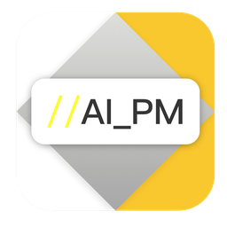

<p align="center">
  
</p>
<h1 align="center">AI PM</h1>
<p align="center">
  AI 产品经理 — 一句话需求，几分钟产出 PRD、原型和评审报告。
</p>
<p align="center">
  <a href="https://github.com/K3tty5555/AI_PM/releases"></a>
  <a href="LICENSE"></a>
</p>
<p align="center">
  <a href="README.md">English</a> | <a href="README_zh-CN.md">简体中文</a>
</p>

---

## 这是什么

AI PM 是一套 AI 产品经理工具。输入一句需求描述，自动完成需求分析、竞品研究、用户故事拆解、PRD 撰写、原型设计和六角色评审会议。

有两种使用方式，功能互补：

| | Claude Code 版 | 桌面客户端 |
|---|---|---|
| 形态 | Claude Code 内的技能集 | 独立桌面应用（macOS / Windows） |
| 交互 | 命令行对话 | GUI 可视化操作 |
| 前置条件 | [Claude Code](https://claude.ai/code) 订阅 | API Key 或本地 Claude CLI |
| 核心优势 | 工具链强：网页搜索、脚本执行、多 Agent 并行 | 体验好：进度可视化、拖拽排序、设备预览、暗色模式 |

## 功能一览

### 完整产品流程（9 个阶段）

```
需求收集 → 需求分析 → 竞品研究 → 用户故事 → PRD → 埋点设计 → 原型 → 六角色评审 → 复盘
```

每个阶段独立保存，随时可以恢复和跳过。

### PRD 多格式导出
- **Markdown** — 原生格式，始终生成
- **PDF** — 15 套封面模板，Chrome 无头渲染
- **DOCX** — 13 套配方风格，可直接导入飞书
- **PPT** — 18 套配色方案、5 种页面类型，从 PRD 自动生成演示文稿
- **分享页** — 独立 HTML，发给干系人即可查看

### 工具箱
| 工具 | 说明 |
|------|------|
| **需求优先级评估** | 四维打分（业务价值/实现成本/用户影响/战略契合），支持批量处理和回复模板 |
| **工作周报** | 随意描述本周工作，输出向上汇报版或团队同步版 |
| **现场调研** | 结构化访谈提纲 + 实时记录，现场生成 PRD |
| **数据洞察** | 上传 Excel/CSV，挖掘业务洞察，生成交互式仪表盘 |
| **产品分身** | 学习你的 PRD 写作风格，让 AI 输出越来越像你 |
| **设计规范** | 加载公司 UI 规范，原型自动遵守设计标准 |
| **知识库** | 沉淀设计模式、决策记录、踩坑经验，自动推荐 |
| **AI 插图** | 用 Seedream AI 生成流程图和图示 |
| **PPT 生成** | PRD 一键转演示文稿，行业配色自动匹配 |
| **截图分析** | 竞品 UI 分析 — 5 种模式：界面描述、文字提取、设计评审、数据提取、组件识别 |

### 桌面客户端特色
- 项目 Dashboard（搜索/过滤/收藏/进度条）
- 用户故事拖拽排序（StoryBoard）
- PRD 目录导航 + Mermaid 实时渲染
- 原型设备模拟预览（Mobile / Tablet / Desktop）
- 原型动效档位选择（低·克制 / 中·平衡 / 高·丰富）
- 六角色评审结果 Tab 切换
- CLI 增强模式：竞品研究自动搜索网页，原型生成支持多文件
- 分段渐现：内容按段落 fade-in 渐次呈现
- 生成进度：工具调用实时状态 + Token 费用显示
- 暗色模式 · 快捷键（⌘K / ⌘B / ⌘1-9）

## 快速开始

### 方式一：Claude Code 版

```bash
git clone https://github.com/K3tty5555/AI_PM.git
cd AI_PM
claude  # 打开 Claude Code
```

```
/ai-pm "我想做一个记账小程序，帮助年轻人管理日常开支"
```

AI 会引导你完成需求澄清，然后逐步推进到 PRD 和原型。

### 方式二：桌面客户端

从 [Releases](https://github.com/K3tty5555/AI_PM/releases) 下载安装包：
- macOS：`AI.PM_x.x.x_universal.dmg`
- Windows：`AI.PM_x.x.x_x64-setup.exe`

首次启动后在设置页面配置 AI 后端（三选一）：
- **Anthropic API** — 填写 API Key
- **OpenAI 兼容接口** — 填写 Base URL + Key（支持中转）
- **Claude CLI** — 复用本机已登录的 Claude Code，无需额外 Key

## Claude Code 命令速查

| 命令 | 说明 |
|------|------|
| `/ai-pm [需求]` | 完整流程：需求 → PRD → 原型 → 评审 |
| `/ai-pm --team [需求]` | 复杂需求，多 Agent 并行协作 |
| `/ai-pm continue` | 恢复上次未完成的项目 |
| `/ai-pm priority` | 需求优先级评估 |
| `/ai-pm weekly` | 工作周报生成 |
| `/ai-pm interview` | 现场调研 / 客户访谈 |
| `/ai-pm data [文件]` | 数据洞察分析 |
| `/ai-pm persona` | 产品分身（风格学习） |
| `/ai-pm design-spec` | 设计规范管理 |
| `/ai-pm knowledge` | 产品知识库 |

独立技能：`/ai-pm-analyze`、`/ai-pm-research`、`/ai-pm-story`、`/ai-pm-prd`、`/ai-pm-prototype`、`/ai-pm-review`

## 两版功能对比

| 能力 | Claude Code 版 | 客户端 |
|------|:---:|:---:|
| 网页搜索（竞品研究） | 原生 | CLI 模式 |
| 脚本执行（数据分析） | 原生 | CLI 模式 |
| 多 Agent 并行 | 支持 | 规划中 |
| Playwright 网页分析 | 支持 | 需本地配置 |
| 可视化 Dashboard | - | 支持 |
| 拖拽编辑 | - | 支持 |
| 设备模拟预览 | - | 支持 |
| 先聊聊（Brainstorm） | 天然对话 | 专属模式 |
| 离线使用 | 需在线 | API 模式需在线 |

## 技术栈

| 层 | 技术 |
|----|------|
| 前端 | React 19、TypeScript 5、Vite 6、TailwindCSS 4、Mermaid 11 |
| 后端 | Tauri 2、Rust、SQLite |
| AI 技能 | Claude Code Skills（Markdown 定义，23 个技能） |
| 导出脚本 | Python 3（python-docx、python-pptx、Pillow） |
| CI/CD | GitHub Actions，macOS 通用二进制 + Windows x64 |

## 项目结构

```
.claude/skills/          # 23 个 AI 技能（Claude Code）
app/src/                 # React 前端（13 页面、9 工具、63 组件）
app/src-tauri/           # Rust 后端（13 个命令模块）
templates/               # PRD 风格、UI 规范、知识库、预设配置
docs/                    # 设计规范、实施计划
output/                  # 项目输出（不纳入版本库）
AI_PM_教程中心.html       # 可视化教程（浏览器打开，无需网络）
```

## 使用教程

打开项目根目录的 `AI_PM_教程中心.html`（浏览器直接打开，无需网络），包含两个版本的完整使用指南。

## 许可证

[MIT](LICENSE)
