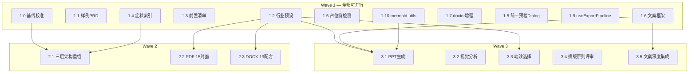

# AI PM v0.4.0 迭代设计 — MiniMaxSkills 学习落地

> **状态:** 已审视（25 项修订）→ 待实施
> **来源:** `docs/plans/2026-03-28-minimax-skills-learning-summary.md`
> **版本:** v0.4.0
> **审视:** 2026-03-28 四视角（架构师/后端/前端/UI-UX），25 项问题全部修订

## 总览

三波执行，方案 C（按依赖图最优并行）：

| Wave | 主题 | 项数 | 特点 |
|------|------|:----:|------|
| 1 | 快速见效 | 13 项（含基线校准） | 全部独立可并行 |
| 2 | 架构 + 质感 | 5 项 | 架构重组 + 导出增强 |
| 3 | 大功能 | 8 项 | PPT 生成 + 视觉分析 + 评审增强 |

## 关键架构决策（审视修订）

| 决策点 | 选择 | 理由 |
|--------|------|------|
| PPT 生成运行时 | **python-pptx**（非 PptxGenJS） | 复用已有 Python 通道，不引入 Node.js 第二运行时，保持 Tauri 自包含分发 |
| 导出预检 Dialog | **统一预检报告 Dialog** | 三步串行 Dialog 认知负荷过高，合并为一个分区 Dialog |
| Prd.tsx 状态管理 | **useExportPipeline hook + 子组件拆分** | 当前 35 个 useState 已接近极限，再加功能必须重��� |
| 配方/封面配置格式 | **JSON**（非 Markdown） | 需被 Rust/Python 解析，JSON 结构化 + 可校验 |
| industry 字段 | **独立于 project_type** | project_type = 产品形态，industry = 行业维度，各有消费场景 |
| 封面/配色选择模式 | **智能默认 + 可展开调整** | Hick 定律——默认自动推荐，一键确认，展开才显示全部选项 |

---

## Wave 1：快速见效（13 项，全部可并行）

### 1.0 基线校准（新增）

**技能侧：**
- 盘点 `.claude/skills/ai-pm/` 实际文件结构，输出与设计假设的 diff
- 确认 `phase-workflows.md`、`user-interaction.md`、`edge-cases.md`、`web-analysis.md` 是否存在及内容
- 校准所有后续任务中引用的"当前"路径
- 结果更新到本设计文档的"Wave 2 迁移策略"中

### 1.1 样例 PRD 文件

**技能侧：**
- 新建 `templates/prd-styles/default/sample-b2b-saas.md`（300-500 行）
- 新建 `templates/prd-styles/default/sample-consumer-app.md`
- 新建 `templates/prd-styles/default/sample-internal-tool.md`
- 修改 `ai-pm-prd/SKILL.md`：Phase 5 生成前根据 project_type 读取对应样例
- doctor 增强（1.7）中加"样例与模板字段一致性检查"

**客户端：**
- 修改 `Prd.tsx`：顶部工具栏"参考样例"按钮 → Dialog（master-detail 布局：左列 3 个样例带行业标签，右侧实时预览选中样例前 20 行）
- Rust 新增 `list_prd_samples` / `get_prd_sample_content`（白名单策略：只允许读取 `sample-*.md` 文件名，不接受自由路径）

### 1.2 行业设计预设

**技能侧：**
- 新建 `templates/presets/industry-style-presets.json`（注意：放 `presets/` 而非 `configs/`，避免 .gitignore 问题）

```json
{
  "finance":    { "label": "金融/法律", "accent": "#1E3A5F", "bg": "#F5F5F0", "font": "serif", "keywords": "权威、稳重" },
  "healthcare": { "label": "医疗/健康", "accent": "#0D7377", "bg": "#F0F9F4", "font": "sans-serif", "keywords": "信任、洁净" },
  "tech":       { "label": "科技/互联网", "accent": "#4F46E5", "bg": "#F8FAFC", "font": "sans-serif", "keywords": "创新、简洁" },
  "education":  { "label": "教育", "accent": "#1B4F72", "bg": "#FDF6EC", "font": "mixed", "keywords": "严谨、亲和" },
  "ecommerce":  { "label": "电商/零售", "accent": "#DC2626", "bg": "#FFFBEB", "font": "bold-sans", "keywords": "活力、促销感" },
  "enterprise": { "label": "企业内部工具", "accent": "#374151", "bg": "#F9FAFB", "font": "system", "keywords": "克制、高效" }
}
```

**客户端：**
- 修改 `new-project-dialog.tsx`：增加"行业"下拉，7 项（含"通用/不指定"默认选项），每项左侧 16px 色块圆点预览主色
- placeholder 文案："选择行业（可选，影响配色推荐）"
- TypeScript 类型：

```typescript
export type Industry = "general" | "finance" | "healthcare" | "tech" | "education" | "ecommerce" | "enterprise"
```

- Rust 侧：项目表新增 `industry TEXT DEFAULT 'general'`（migration version +1），`create_project` / `get_project` 扩展
- `industry` 与 `project_type` 关系明确：project_type = 产品形态（to-b/to-c/internal），industry = 行业。各自独立，下游按需消费
- 行业变更不自动修改已确认的配置，只影响后续新推荐
- 旧项目 `industry = 'general'` 时推荐回退到"企���内部工具"预设

### 1.3 前置检查清单

**技能侧：**
- Phase 5 PRD 预检：需求分析存在、竞品 ≥2 家、用户故事已拆、用户画像已确认（人工）、风格已选
- Phase 7 原型预检：PRD 完成且评分达标、设计规范已选、关键页面确认（人工）
- 检查项分两类：**自动检查**（文件/目录存在用 glob 匹配，非精确文件名）+ **人工确认**（由用户勾选）

**客户端：**
- 修改 `Prd.tsx`、`Prototype.tsx`：生成按钮上方显示预检卡片
- 全部通过：折叠为 Accordion "预检通过 ✅"（可点击展开查看详情，`aria-expanded`）
- 有未通过：展开显示，跳转链接在新标签打开 + Toast "补充完成后回到本页即可"
- 回到页面时自动刷新预检状态
- Rust 新增 `check_phase_prerequisites`：接收 projectId + phaseId，用 glob 检查前序产物，返回检查项列表（自动项带状态，人工项标记为 `manual`）

### 1.4 症状索引重组

**技能侧（仅）：**
- 重写 `edge-cases.md`（或实际对应文件）为症状驱动索引，左右两侧语言风格统一口语化：

```
"PRD 太长了"           → 帮你按模块拆分，建议分文档管理
"原型和 PRD 对不上"     → 帮你检查原型和 PRD 是否对齐（审计流程）
"上次做到哪了"          → 读取进度文件，帮你恢复到上次的阶段
"不想做竞品研究"        → 可以跳过，帮你记录跳过原因
"换个风格"             → 重新选择 PRD 风格或原型设计规范
"需求改了"             → 回到分析阶段，帮你标记变更点
"生成的 PRD 质量不好"   → 检查样例对照，调整生成参数
"导出格式有问题"        → 检查排版配方和字体可用性
"评审意见太多不知从何改" → 帮你按严重程度排序，逐项决定采纳或拒绝
```

### 1.5 占位符 / AI 痕迹检测

**技能侧：**
- 修改 PRD 导出流程增加扫描规则：`[待补充]`、`[此处填写]`、`TBD`、`TODO`、`Lorem ipsum`、`placeholder`、`[Feature Name]`、`[产品名]`、`[公司名]`、`xxxx`、`FIXME`

**客户端：**
- **不再单独弹 Dialog**（审视修订：合并到统一预检 Dialog，见 1.8）
- Rust 新增 `scan_placeholders` 命令：正则扫描 markdown，返回 `Vec<PlaceholderMatch>`
- 正则排除 Markdown 链接中的方括号（如 `[链接文本](url)` 不误报）

### 1.6 文案框架模板

**技能侧（仅）：**
- 新建 `templates/presets/copywriting-frameworks.md`（放 `presets/` 非 `configs/`）
- 含 AIDA / PAS / FAB 三种框架 prompt 模板 + CTA 公式 + 异议处理模板
- 注入点标注：Phase 3 → AIDA，Phase 5 → FAB，Phase 8 → CTA 审计

### 1.7 doctor 命令增强

**技能侧：**
- 新增检查项：
  - 技能描述包含触发条件
  - 技能文件超 500 行警告
  - 模板文件可读性
  - 样例 PRD 与模板字段一致性
  - 硬编码密钥扫描（精确正则：`sk-[a-zA-Z0-9]{20,}`���`AKIA[0-9A-Z]{16}`，排除 docs/ 和 MEMORY.md）
  - 行业预设完整性
  - SKILL.md 路由表引用的所有文件路径存在性检查

**客户端：** 无需改前端（DiagnosticsPanel 自动展示）。Rust 修改 `run_diagnostics` 增加检查项。

### 1.8 统一导出预检 Dialog（审视新增）

**客户端：**
- 新建 `app/src/components/export-preflight-dialog.tsx`
- 替代现有的 `SensitiveScanDialog` + `MermaidRenderDialog` + 新增的占位符检测，合并为**一个统一 Dialog**

```
┌─ 导出预检 ──────────────────────────────────┐
│                                               │
│  [敏感信息] [占位符] [流程图]  ← 分区 Tab     │
│                                               │
│  ── 当前 Tab 内容区 ──                        │
│  （每个 Tab 内容与原独立 Dialog 一致）          │
│  （空的 Tab 不显示 — 如无占位符则该 Tab 隐藏） │
│                                               │
│  汇总：2 处敏感信息 · 1 处占位符 · 3 个流程图   │
│                                               │
│         [返回编辑]                   [导出]    │
└───────────────────────────────────────────────┘
```

- 只有检测到问题的 Tab 才显示，全部为空则跳过 Dialog 直接导出
- 每个 Tab 右上角显示该类问题数量 Badge

### 1.9 useExportPipeline hook + Prd.tsx 拆分（审视新增）

**客户端：**
- 新建 `app/src/hooks/use-export-pipeline.ts`
- 用状态机管理导出流程：`idle → scanning → preflightDialog → formatDialog → exporting → done`
- 将 Prd.tsx 中所有导出相关状态（~15 个 useState）迁移到 hook 中
- Prd.tsx 拆分子组件：`PrdToolbar`（工具栏）、`PrdExportFlow`（导出流程）、`PrdEditor`（编辑区）

### 1.10 mermaid-utils.ts 提取（审视新增）

**客户端：**
- 新建 `app/src/lib/mermaid-utils.ts`
- 提取 `detectMermaidType`、`STYLE_RECOMMENDATIONS`、`extractMermaidBlocks` 到此文件
- `Illustration.tsx`、`Prd.tsx`（导出预检）、后续 PPT 技能统一引用

---

## Wave 2：架构重组 + 输出质感（5 项）

### 2.1 三层知识架构 + Phase 拆分 + 路由表

**技能侧（仅）：**

基于 1.0 基线校准的实际结果重组，目标结构：

```
.claude/skills/ai-pm/
├── SKILL.md                    # Tier 1: 路由表（~100 行）
├── phases/                     # Tier 2: 按 Phase 拆分（10 个文件，含 Phase 4/6）
│   ├���─ phase-0-office-hours.md
│   ├── phase-1-requirement.md
│   ├── phase-2-analysis.md
│   ├── phase-3-research.md
│   ├── phase-4-stories.md
│   ├── phase-5-prd.md
│   ├── phase-6-analytics.md
│   ├── phase-7-prototype.md
│   ├── phase-8-review.md
│   └── phase-9-retrospective.md
├── references/                 # Tier 3: 深度参考
│   ├── user-interaction.md
│   ├── web-analysis.md
│   ├── symptom-index.md
│   └── illustration.md
├── doctor.md
└── status-check.sh
```

**SKILL.md 路由表：**
```
用户输入
├─ 新需求 → Phase 0 → 读 phases/phase-0-office-hours.md
├─ 继续项目 → 读 _status.json → 恢复对应 Phase
├─ 单独某阶段 → 跳转指定 Phase
├─ 工具命令 → 路由到工具技能
├─ 项目管理 → 项目管理命令
├─ 诊断 → 读 doctor.md
└─ 未知 → 询问意图
```

**迁移策略（原子操作）：**
1. 先创建 `phases/` 和 `references/` 目录及所有新文件
2. 验证所有文件内容完整
3. 更新 SKILL.md 路由表指向新路径
4. 运行 doctor 验证所有路由目标存在
5. 最后删除旧文件
6. **迁移前 git tag 快照**（`v0.4.0-pre-restructure`）
7. SKILL.md 保留 fallback 逻辑：Phase 文件不存在时尝试读旧路径

### 2.2 PDF 封面模板 + 行业配色

**技能侧：**
- 新建 `templates/presets/pdf-covers.json`（JSON 格式，非 Markdown）

15 种封面模板，每种含中文别名：

| ID | 中文别名 | 特征 | 适用 |
|----|---------|------|------|
| fullbleed | 深色全幅 | 深色背景 + 点阵网格 | 报告、通用 |
| split | 分栏提案 | 左 42% 色块 + 右 58% | 提案 |
| typographic | 字体主导 | 超大首词 + 下划线 | 简历、学术 |
| atmospheric | 光晕暗调 | 近黑 + 径向光晕 | 作品集 |
| minimal | 极简侧线 | 8px 左侧强调条 | 内部文档 |
| stripe | 三色带 | 三条水平色带 | 营销材料 |
| diagonal | 斜切创意 | SVG 对角切割 | 创意方案 |
| frame | 边框证书 | 内缩边框 + 角饰 | 正式��请 |
| editorial | 编辑出版 | 幽灵首字母 + 全宽 | 出版风 |
| magazine | 杂志风 | 暖奶油 + 主图 | 杂志风 |
| darkroom | 暗房影调 | 海军蓝 + 灰度滤镜 | 摄影 |
| terminal | 极客终端 | 近黑 + 霓虹绿 | 技术方案 |
| poster | 海报风 | 白底 + 粗左边栏 | 海报 |
| report | 正式报告 | fullbleed 变体 | 年度报告 |
| proposal | 商业提案 | split 变体 | 商业提案 |

字体/间距/配色规则同原设计。配色心理学规则作用域限定：**仅适用于 PDF 封面默认配色，不影响客户端 UI Accent 色。**

**客户端：**
- PDF 导出时弹出封面选择 Dialog
- **智能默认模式**：根据行业自动推荐封面，Dialog 显示"推荐封面"大预览 + 一键"使用推荐"
- "更多选择"展开后分类显示：通用(fullbleed/minimal/report) / 正式(split/proposal/frame) / 创意(diagonal/stripe/poster/editorial) / 学术(typographic/atmospheric) / 特殊(magazine/darkroom/terminal)
- 每个缩略图用轻量 PNG（非实时 SVG）+ 中文别名
- ☑"记住选择"勾选
- Rust 新增 `list_pdf_covers` / `export_prd_pdf` 扩展 `coverStyle` + `accentColor` 参数

### 2.3 DOCX 13 套排版配方

**技能侧：**
- 新建 `templates/presets/docx-recipes.json`（JSON 格式）
- 每套配方含完整参数 + **字体 fallback 链**：

```json
{
  "ChineseGovernment": {
    "label": "中国公文 (GB/T 9704)",
    "pageSize": "A4",
    "margins": { "top": "3.7cm", "bottom": "3.5cm", "left": "2.8cm", "right": "2.6cm" },
    "bodyFont": ["仿宋_GB2312", "仿宋", "FangSong", "SimSun", "serif"],
    "titleFont": ["方正小标宋简体", "华文中宋", "SimSun", "serif"],
    "bodySize": "16pt",
    "lineSpacing": "28pt fixed",
    "..."
  }
}
```

- `md2docx.py` 修改：启动时检测字体可用性，不可用时按 fallback 链自动降级 + warning

13 套配方列表同原设计（ModernCorporate / AcademicThesis / ExecutiveBrief / ChineseGovernment / IEEE / ACM / APA7 / MLA9 / ChicagoTurabian / SpringerLNCS / Nature / HBR / MinimalProposal）。

**客户端：**
- DOCX 导出时弹出配方选择 Dialog
- 三组分类：**推荐**（行业自动匹配 1-2 个，置顶高亮默认选中）/ **商务通用**（ModernCorporate / ExecutiveBrief / MinimalProposal / ChineseGovernment / HBR）/ **学术规范**（IEEE / ACM / APA7 / MLA9 / ChicagoTurabian / SpringerLNCS / Nature / AcademicThesis）
- 折叠区用 `<details>/<summary>` 或 `aria-expanded` 按钮，Tab 可达、Enter/Space 展开
- Rust 修改 `export_prd_docx` 接收 `recipe` 参数

---

## Wave 3：大功能（8 项）

### 3.1 ai-pm-pptx 技能（PRD → PPT）

**关键变更（审视修订）：使用 python-pptx，不引入 Node.js。**

**技能侧：**

```
.claude/skills/ai-pm-pptx/
├── SKILL.md
├── references/
│   ├── design-system.md    # 18 套配色 + 4 种风格配方 + 字体搭配
│   ├── page-types.md       # 5 种页面类型
│   ├── pitfalls.md         # 致命陷阱
│   └── qa-workflow.md      # 验证循环
└── scripts/
    ��── prd2pptx.py         # python-pptx 生成脚本（替代 PptxGenJS）
    └── verify.py           # markitdown 提取 + 占位符检测
```

命令：`/ai-pm pptx [PRD路径]`

三层编排：
1. 规划层：PRD → 章节提取 → 幻灯片大纲
2. 设计层：行业预设 → 配色 + 风格 + 字体
3. 生成层：`prd2pptx.py`（python-pptx）编译 .pptx

5 种页面类型 + 布局多样性规则（相邻 Content 页不同子布局）同原设计。

18 套配色方案：全部引入，按分组组织：
- 推荐（根据行业匹配）
- 商务（business-authority / platinum-white-gold / tech-blue）
- 创意（dreamy-creative / bohemian / art-food / coastal-coral）
- 自然（nature-outdoor / forest-eco）
- 学术（vintage-academic / education-chart）
- 科技（tech-vibrant / tech-nightscape）
- 其他（modern-health / artisan-handmade / elegant-fashion / luxe-mystery / orange-mint）

4 种风格配方 + 字体搭配同原设计。

QA 流水线：markitdown 加入 check_env 检测列表（`pip install markitdown`）；未安装时降级为从 python-pptx 直接提取文本验证。

致命陷阱：
- python-pptx 的 Inches/Pt/Emu 单位换算（`from pptx.util import Inches, Pt, Emu`）
- 标题下方不用强调线（AI 标志，用留白替代）
- 中文字体设置必须用完整字体名（如"微软雅黑"非"Microsoft YaHei"）
- 母版布局引用需精确匹配 slide_layout.name

**客户端：**

新建工具页 `app/src/pages/tools/Pptx.tsx`：

**分步向导模式（审视修订：非一页平铺）：**
- **Step 1：** 来源选择（选择项目 PRD 或粘贴内容）
- **Step 2：** 设计方案（系统自动推荐：配色+风格+字体打包为一个"设计方案"，用户一键确认或"自定义"展开独立调整）
  - 配色下拉分组（推荐/商务/创意/学术/科技），每项带 5 色 swatch 预览条
- **Step 3：** 大纲确认（列出每页类型+标题，上下箭头调整顺序，MVP 不做拖拽，后续可引入 @dnd-kit/sortable）
- 生成结果：下载 .pptx / 在 Finder 中显示
- 所有异步操作有 loading 态（Spinner + 进度文案）和 error 态（Toast + 重试）

PRD 页面导出菜单增加"导出为 PPT"→ 跳转 PPT 工具页。
路由 `/tools/pptx`，侧边栏"演示文稿"链接。

Rust 侧：
- 新增 `commands/pptx.rs`：`generate_pptx_outline`、`generate_pptx`（调用 Python `prd2pptx.py`）、`list_pptx_history`
- 无需 Node.js 运行时

### 3.2 竞品截图视觉分析

**技能侧：**
- 修改 `ai-pm-research/SKILL.md`：增加截图分析路径

5 种分析模式（用户友好命名）：

| 内部 ID | 用户名称 | 一句话说明 | 输出 |
|---------|---------|-----------|------|
| describe | 界面描述 | 描述截图中的布局、功能区域和色彩 | 详细描述 |
| ocr | 文字提取 | 提取截图中的所有文字，保留结构 | 结构化文本 |
| ui-review | 设计评审 | 评审界面设计的优缺点并给改进建议 | 优点/问题/建议 |
| chart-data | 数据提取 | 从图表中提取数据点和趋势 | 数据 + 趋势 |
| object-detect | 组件识别 | 识别界面中使用的 UI 组件及位置 | 组件清单 |

默认使用"设计评审"模式。

实现方式：Claude 自身多模态（读取图片 → 分析），不依赖外部 vision API。

`analyze_screenshot` 接口契约：
- 输入：`{ imagePath: String, mode: String, context: Option<String> }`
- 输出：`{ markdown: String, mode: String }` — 结构化 Markdown 分析报告
- 错误：图片过大(>10MB 自动缩放) / API 不可用 / 格式不支持
- 通过 `claude_cli.rs` 现有通道发送，`--image` 参数传图片路径
- 分析前提示预估 token 消耗，给用户确认

`capture_url_screenshot` 安全约束：
- URL scheme 仅允许 `http://` 和 `https://`
- 拒绝 `file://`、`javascript:`、`data:`
- 私有 IP 段（10.x / 172.16-31.x / 192.168.x / 127.x）显示警告"检测到内网地址"
- 超时 30s

**客户端：**
- 修改 `app/src/pages/project/Research.tsx`（明确是 Research，非 Analysis）
- SegmentedControl "文本研究" / "截图分析"
- 截图分析 Tab：拖拽上传 + URL 输入 + 分析模式下拉（默认"设计评审"，每项带一句话说明）
- 加载态：Skeleton + "分析中..."
- 错误态：Toast + 重试
- 结果用 PrdViewer 渲染 + "保存到竞品报告"按钮

### 3.3 原型动效强度选择

**技能侧：**
- 修改原型 Phase 文件，增加动效档位参数注入 prompt

三档（审视修订：三个旋钮联动，用户只选一个档位）：

| 档位 | MOTION_INTENSITY | VISUAL_DENSITY | DESIGN_VARIANCE | 适用 |
|------|:---:|:---:|:---:|------|
| 低·克制 | 2 | 3 | 4 | B 端、内部工具 |
| 中·平衡 | 6 | 5 | 7 | C 端、移动端 |
| 高·丰富 | 8 | 7 | 9 | 营销页、品牌展示 |

旋钮值注入方式：写入 prototype phase 的 prompt template `{MOTION_INTENSITY}` 占位符。
技能文件为每个档位提供 CSS/JS 白名单作为硬约束（低档只允许 `transition`，中档允许 `framer-motion`，高档允许 `gsap`）。

**客户端：**
- 修改 `Prototype.tsx`：原型生成按钮上方用 **SegmentedControl**（复用现有组件）
- 三段标注"低·克制"/"中·平衡"/"高·丰富"，推荐项带 Badge
- 根据项目行业自动推荐
- Rust：项目配置新增 `motionIntensity`，prototype prompt 注入

### 3.4 六大排版原则嵌入评审

**技能侧（仅）：**
- 修改 `ai-pm-review/SKILL.md`

Phase 8 "UI/UX 设计师"角色新增：

1. **留白呼吸** — 内容覆盖率 60-70%？
2. **对比与缩放** — 标题层级 2+ 维度差异？眯眼测试？
3. **亲近与分组** — 标题离下方更近？列表间距 < 段间距？
4. **对齐与网格** — 对齐一致？中文两端对齐？
5. **重复与一致** — 同级相同样式？无孤立格式？
6. **视觉层次** — 视线路径清晰？

每条 ✅/⚠️/❌ + 问题 + 修复建议。

### 3.5 文案框架深度集成

**技能侧（仅）：**
- Phase 3 → AIDA 价值主张
- Phase 5 → FAB 功能描述
- Phase 8 → CTA 审计 + 异议覆盖检查

---

## 依赖关系



## 不做的事（YAGNI）

- 不做 PPT 模板编辑器（当前生成质量足够，编辑器开发成本高且使用频率低）
- 不做视频/音乐/TTS 生成（MiniMax multimodal toolkit 能力暂不引入，PM 场景优先级低）
- 不做 GIF 贴纸制作（营销场景，非核心 PM 工作流）
- 不做 shader/WebGL 效果（图形渲染，与 PM 无关）
- 不做 Excel 高级操作（公式修复、透视表，当前 pandas 够用）
- 不做移动端开发指南（开发者工具，PM 不直接用）
- PDF 封面不做实时预览（用静态 PNG 缩略图，降低 DOM 复杂度）
- DOCX 配方不做可视化编辑器（用预定义 JSON 参数）
- PPT 大纲 MVP 不做拖拽排序（用上下箭头按钮，后续可引入 @dnd-kit/sortable）
- Node.js 运行时不引入（PPT 用 python-pptx 保持单一 Python 通道）
