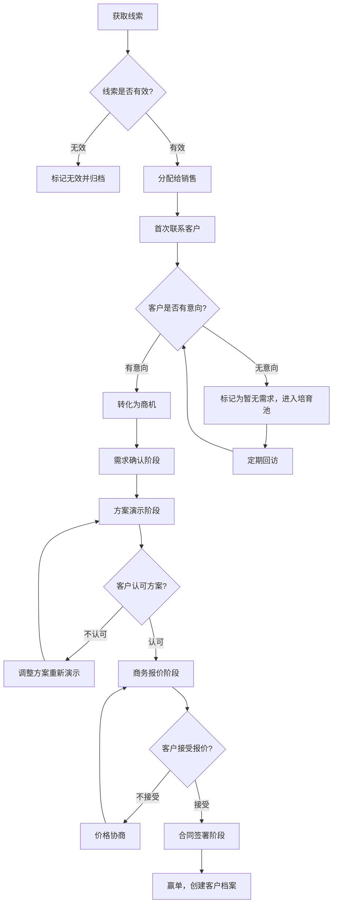
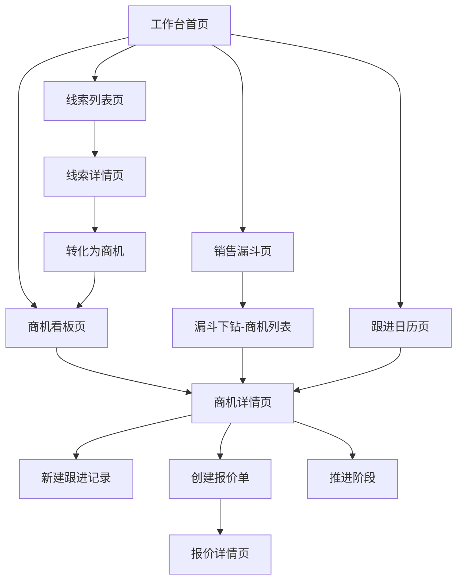

# 智联CRM销售管线管理模块功能需求文档

---

## 一、文档概述

### 1.1 评审/修订日志

| 日期 | 修订版本 | 修改描述 | 涉及影响模块 | 作者 | 备注 |
|------|---------|---------|-------------|------|------|
| 2026-03-28 | v1.0 | 初稿创建 | 线索管理、商机管理、销售漏斗、客户跟进 | AI_PM | 样例文档 |

---

## 二、需求分析

### 2.1 需求背景

**需求来源**：主动规划 - 中小企业销售团队数字化转型需求

**目标人群及场景**：
- 目标用户：20-200 人规模的中小企业销售团队，包括一线销售、销售主管和销售总监
- 使用场景：日常客户跟进、销售例会数据回顾、季度业绩目标追踪、新人上手培训
- 核心痛点：销售过程不透明，主管无法及时掌握商机推进状态，丢单原因难以复盘

**需求影响范围**：
- 用户规模：首期目标 500 家企业客户，覆盖约 1 万名销售人员
- 覆盖场景：从线索获取到成单收款的完整销售闭环
- 业务价值：提升销售转化率 15%，缩短平均成单周期 20%

**需求痛点**（引用需求分析报告）：
1. Excel/微信管理客户信息，数据分散、交接困难，销售离职后客户资料易丢失
2. 商机阶段缺乏标准化定义，不同销售对"意向客户"的理解差异大，管理层难以横向比较
3. 跟进任务依赖个人记忆，超过 30% 的待跟进客户被遗忘，导致商机流失
4. 销售漏斗无法实时查看，销售例会靠口头汇报，数据滞后 1-2 周

### 2.2 需求价值

**定性描述**：
智联 CRM 销售管线管理模块将为中小企业提供一套标准化的销售过程管理工具。通过线索统一归集、商机阶段可视化推进、自动化跟进提醒三大能力，帮助销售团队建立可量化、可复盘、可预测的销售体系。对销售个人而言，减少事务性工作、聚焦高价值客户；对管理层而言，实现销售过程的实时洞察和科学决策。

**定量指标**：

| 指标类型 | 指标名称 | 目标值 | 验收标准 |
|---------|---------|-------|---------|
| 效率指标 | 销售日均手动录入时间 | 减少 40% | 上线 3 个月后对比基线数据 |
| 效率指标 | 平均成单周期 | 缩短 20% | 上线 6 个月后统计 |
| 体验指标 | 商机跟进遗漏率 | 降至 5% 以下 | 上线 3 个月后统计超期未跟进商机占比 |
| 业务指标 | 线索→商机转化率 | 提升 15% | 上线 6 个月后对比历史数据 |

**优先级评估**：P0（销售管线管理是 CRM 产品核心能力，决定产品市场竞争力）

---

## 三、功能清单

### 3.1 主要功能说明

| 模块 | 功能 | 子功能 | 描述 | 优先级 | 备注 |
|------|------|--------|------|--------|------|
| 线索管理 | 线索录入 | 手动录入 | 销售手动填写线索信息（公司名、联系人、来源等） | P0 | - |
| 线索管理 | 线索录入 | 批量导入 | 支持 Excel/CSV 批量导入线索 | P1 | 模板下载 |
| 线索管理 | 线索分配 | 自动分配 | 按区域/行业规则自动分配给销售 | P1 | 需配置分配规则 |
| 线索管理 | 线索分配 | 手动分配 | 主管手动指定线索归属销售 | P0 | - |
| 线索管理 | 线索转化 | 转为商机 | 确认线索有效后一键转为商机 | P0 | 保留线索原始信息 |
| 商机管理 | 商机看板 | 阶段看板 | 以看板形式展示各阶段商机分布 | P0 | 支持拖拽推进 |
| 商机管理 | 商机推进 | 阶段变更 | 记录每次阶段变更的原因和关键信息 | P0 | 变更不可逆 |
| 商机管理 | 商机推进 | 赢单/输单 | 标记最终结果并记录原因 | P0 | 输单原因必填 |
| 商机管理 | 报价管理 | 创建报价 | 关联商机创建报价单 | P1 | 支持多版本 |
| 销售漏斗 | 漏斗分析 | 整体漏斗 | 展示线索→商机→报价→成单的转化漏斗 | P0 | 支持时间筛选 |
| 销售漏斗 | 漏斗分析 | 个人漏斗 | 展示单个销售的漏斗数据 | P1 | - |
| 销售漏斗 | 预测分析 | 业绩预测 | 基于当前管线数据预测季度完成率 | P2 | 加权概率模型 |
| 客户跟进 | 跟进提醒 | 到期提醒 | 距离下次跟进日期前自动推送提醒 | P0 | 站内信+钉钉/飞书 |
| 客户跟进 | 跟进记录 | 记录填写 | 记录每次跟进的内容、方式和下次计划 | P0 | 支持语音转文字 |
| 客户跟进 | 跟进记录 | 时间线 | 按时间轴展示客户所有互动记录 | P1 | - |

**功能优先级说明**：
- P0：核心功能，必须实现（决定产品核心价值）
- P1：重要功能，建议实现（提升完整体验）
- P2：增值功能，可选实现（锦上添花）

---

## 四、产品流程

### 4.1 业务流程图

**流程说明**：
1. 线索来源包括官网注册、市场活动、转介绍等渠道，进入系统后先经过有效性判断
2. 有效线索按区域/行业规则分配给对应销售，销售在 24 小时内完成首次联系
3. 确认客户有明确需求后，线索转为商机，进入标准化的阶段推进流程
4. 商机依次经过需求确认→方案演示→商务报价→合同签署四个阶段
5. 每个阶段都有明确的准入和准出条件，阶段推进需填写关键信息
6. 暂无需求的客户进入培育池，系统定期提醒销售回访

### 4.2 页面流程图

**页面层级**：
- 一级页面：工作台首页（销售工作的统一入口，展示待办、关键指标和快捷操作）
- 一级页面：线索列表页（线索的筛选、查看和批量操作）
- 一级页面：商机看板页（以看板视图管理所有商机的阶段推进）
- 一级页面：销售漏斗页（各维度的漏斗分析和业绩预测）
- 二级页面：线索详情页（单个线索的完整信息和操作）
- 二级页面：商机详情页（商机的全部信息、跟进记录和关联报价）
- 三级页面：报价详情页（报价单的创建、编辑和版本管理）

**核心页面跳转**：
- 工作台 → 点击"待跟进客户"卡片 → 商机详情页
- 线索详情页 → 点击"转为商机" → 商机看板页（新建商机自动定位）
- 销售漏斗页 → 点击某阶段柱状图 → 该阶段商机列表

---

## 五、全局说明

### 5.1 名词解释

| 术语 | 解释 | 备注 |
|------|------|------|
| 线索（Lead） | 潜在客户的初始信息，尚未确认购买意向 | 可来自多种渠道 |
| 商机（Opportunity） | 已确认有明确需求的潜在交易，进入销售推进流程 | 由线索转化而来 |
| 销售管线（Pipeline） | 所有进行中商机的集合，反映销售团队的业务健康度 | - |
| 赢单率（Win Rate） | 最终成交商机数占总商机数的比例 | 按季度统计 |
| 培育池（Nurturing Pool） | 暂无明确需求但有潜在价值的客户集合 | 系统定期提醒回访 |
| 销售漏斗（Sales Funnel） | 从线索到成单各阶段客户数量的逐步递减模型 | 用于预测和诊断 |

### 5.2 公共的交互说明

**弹窗/对话框**：
- 确认弹窗：删除线索、放弃商机等不可逆操作需二次确认，文案明确说明操作后果
- 提示弹窗：阶段推进时弹出表单，要求填写推进原因和关键信息

**Toast 提示**：
- 成功提示：操作完成后右上角显示 3 秒自动消失，如"线索已成功转为商机"
- 错误提示：红色文案常驻至用户关闭，如"保存失败，请检查必填项"
- 加载提示：操作耗时超过 500ms 显示加载动画，如"正在导入线索…"

**键盘交互**：
- `Ctrl/Cmd + N`：快速新建（根据当前页面上下文新建线索/商机/跟进记录）
- `Ctrl/Cmd + F`：聚焦搜索框
- `Esc`：关闭当前弹窗或侧边栏

### 5.3 统一异常处理

| 异常类型 | 触发条件 | 处理方式 | 提示文案 |
|---------|---------|---------|---------|
| 网络异常 | 请求超时或无网络连接 | 页面显示断网提示，自动重试 3 次 | "网络连接不稳定，正在尝试重新连接…" |
| 服务异常 | 服务端返回 500 系列错误 | 显示错误提示，引导刷新页面 | "服务暂时不可用，请稍后再试" |
| 权限异常 | 访问非本人数据或越权操作 | 拦截操作并提示 | "你没有权限执行此操作，请联系管理员" |
| 数据异常 | 必填字段为空或格式不合法 | 字段高亮标红，定位到首个异常字段 | "请检查标红字段，{字段名}不能为空" |
| 并发冲突 | 多人同时编辑同一商机 | 后保存者提示冲突，展示差异 | "该记录已被他人修改，请确认是否覆盖" |

### 5.4 列表默认数据、分页

**列表默认规则**：
- 默认排序：按最近更新时间倒序
- 默认筛选：线索列表默认显示"待处理"状态；商机列表默认显示所有进行中商机
- 空状态：显示引导图标 + 引导文案，如"还没有线索，点击右上角'新建'开始添加"

**分页规则**：
- 分页方式：传统分页（底部页码导航）
- 每页数量：20 条（用户可切换为 50/100 条）
- 加载更多：点击页码或翻页按钮加载，列表区域局部刷新

### 5.5 视觉设计规范

本系统采用**智联设计系统 v1.0**，确保视觉风格与品牌一致。

#### 5.5.1 颜色规范

**主色调**：
| 用途 | 色值 | 应用场景 |
|------|------|----------|
| Primary Main | #2563EB | 主按钮、重要链接、选中态 |
| Primary Light | #DBEAFE | 选中行背景、标签背景 |
| Primary Dark | #1E40AF | 按钮 hover 态 |
| Primary BG | #EFF6FF | 页面辅助背景色 |

**语义色**：
| 类型 | 主色 | 背景色 | 应用场景 |
|------|------|--------|----------|
| 成功 | #16A34A | #F0FDF4 | 赢单标记、保存成功 |
| 警告 | #D97706 | #FFFBEB | 即将到期提醒、数据异常 |
| 错误 | #DC2626 | #FEF2F2 | 输单标记、操作失败 |

#### 5.5.2 字体规范

**字体族**：`"PingFang SC", -apple-system, BlinkMacSystemFont, "Segoe UI", Roboto, "Helvetica Neue", sans-serif`

**字号规范**：
| 级别 | 字号 | 行高 | 字重 | 应用场景 |
|------|------|------|------|----------|
| H1 | 24px | 1.4 | 600 | 页面标题 |
| H2 | 20px | 1.4 | 600 | 模块标题 |
| H3 | 16px | 1.5 | 500 | 卡片标题 |
| Body | 14px | 1.5 | 400 | 正文内容 |
| Caption | 12px | 1.5 | 400 | 辅助说明、时间戳 |

#### 5.5.3 间距规范

**基础间距**：4px 基数，梯度 4/8/12/16/20/24/32/40/48px

**组件间距**：
- 卡片内边距：16px
- 表单控件间距：12px
- 列表行间距：8px

#### 5.5.4 圆角与阴影

**圆角规范**：
| 级别 | 值 | 应用场景 |
|------|-----|----------|
| sm | 4px | 输入框、小按钮 |
| base | 8px | 卡片、弹窗 |
| lg | 12px | 大卡片、浮层 |

**阴影规范**：
| 级别 | 值 | 应用场景 |
|------|-----|----------|
| sm | 0 1px 2px rgba(0,0,0,0.06) | 卡片默认态 |
| base | 0 4px 12px rgba(0,0,0,0.1) | 弹窗、下拉菜单 |

#### 5.5.5 组件样式

**按钮样式**：
| 类型 | 背景 | 文字 | 边框 | 悬停 |
|------|------|------|------|------|
| Primary | #2563EB | #FFFFFF | 无 | #1E40AF |
| Secondary | #FFFFFF | #374151 | 1px solid #D1D5DB | 背景 #F9FAFB |
| Danger | #DC2626 | #FFFFFF | 无 | #B91C1C |

#### 5.5.6 布局规范

**页面结构**：
- 顶部导航栏：高度 56px，固定定位，包含 Logo、全局搜索、通知、用户头像
- 左侧导航栏：宽度 220px，可折叠至 64px，包含模块导航
- 内容区域：自适应宽度，最大宽度 1440px 居中，内边距 24px

**响应式断点**：
- 最小支持：1280×720
- 推荐尺寸：1920×1080

---

## 六、详细功能设计

### 6.1 线索管理

| 项目 | 说明 |
|------|------|
| **用户场景** | 销售主管从市场活动、官网注册等渠道获得一批潜在客户信息，需要录入系统并分配给一线销售跟进 |
| **功能描述** | 支持手动录入和批量导入两种方式创建线索。线索创建后进入"待分配"状态，主管可手动分配或由系统按预设规则自动分配。销售确认线索有效后可一键转为商机，无效线索标记原因后归档 |
| **原型图** | [线索管理原型] 左侧筛选面板 + 右侧表格列表布局，顶部操作栏含"新建""导入""批量分配"按钮 |
| **优先级** | P0 |
| **输入/前置条件** | 1. 用户已登录且具有"线索管理"权限 2. 批量导入需先下载模板文件并按模板填写 |
| **需求描述（基本事件流）** | 1. 用户点击"新建线索"按钮，弹出线索信息表单 2. 填写必填字段：公司名称、联系人姓名、手机号/邮箱、线索来源 3. 填写选填字段：行业、地区、预估预算、备注 4. 点击"保存"，系统校验数据后创建线索 5. 线索进入"待分配"列表，等待主管分配 6. 主管在线索列表中勾选线索，点击"分配"，选择目标销售 7. 销售收到分配通知，在"我的线索"中查看并开始跟进 8. 销售评估线索后，选择"转为商机"或"标记无效" |
| **输出/后置条件** | 1. 线索创建后自动生成唯一编号（格式：LD-YYYYMMDD-XXXX） 2. 分配后销售在工作台看到新增待跟进提醒 3. 转为商机后线索状态变更为"已转化"，不可再编辑 |
| **用户权限** | 销售：查看和编辑自己的线索、转化为商机；销售主管：查看团队所有线索、分配和回收线索；管理员：全部权限 |
| **补充说明** | 线索去重规则：以"公司名称 + 联系人手机号"为唯一键，导入时自动检测重复 |

### 6.2 商机阶段看板

| 项目 | 说明 |
|------|------|
| **用户场景** | 销售主管在周一例会前查看团队所有商机的推进状态，快速识别哪些商机停滞、哪些即将成单，为例会讨论做准备 |
| **功能描述** | 以看板形式展示商机在各阶段的分布情况。每一列代表一个销售阶段（需求确认→方案演示→商务报价→合同签署→赢单/输单），每张卡片代表一个商机，展示关键信息。支持拖拽卡片推进阶段，拖拽后弹出表单记录推进原因 |
| **原型图** | [商机看板原型] 横向多列看板布局，每列顶部显示阶段名称和商机数，列内卡片纵向排列，底部汇总金额 |
| **优先级** | P0 |
| **输入/前置条件** | 1. 用户已登录且具有"商机管理"权限 2. 系统中已存在至少一个商机 |
| **需求描述（基本事件流）** | 1. 用户进入商机看板页，系统默认展示本人负责的所有进行中商机 2. 看板从左到右依次展示 5 个阶段列：需求确认、方案演示、商务报价、合同签署、已完结 3. 每张商机卡片展示：客户名称、商机金额、负责人、最近跟进时间、预计成单日期 4. 卡片右上角用颜色标签标识健康度：绿色（正常）、黄色（超过 7 天未跟进）、红色（超过 14 天未跟进） 5. 用户拖拽卡片从当前列移动到下一列，系统弹出"阶段推进"表单 6. 用户填写推进原因、关键成果、下一步计划，点击确认 7. 商机阶段更新，看板实时刷新 |
| **输出/后置条件** | 1. 阶段推进后生成一条跟进记录，自动记入商机时间线 2. 赢单后自动将商机关联的线索标记为"已成交客户" 3. 输单后该商机进入输单分析库，供后续复盘 |
| **用户权限** | 销售：查看和操作自己的商机；销售主管：查看团队所有商机，可代操作团队成员的商机；管理员：全部权限 |
| **补充说明** | 看板视图和列表视图可一键切换，两种视图的筛选条件联动 |

### 6.3 客户跟进提醒

| 项目 | 说明 |
|------|------|
| **用户场景** | 一线销售同时跟进 30+ 个客户，容易遗忘跟进计划。系统根据跟进记录中填写的"下次跟进日期"自动推送提醒，确保每个客户都不被遗漏 |
| **功能描述** | 基于跟进记录中的"计划下次跟进时间"字段，在到期前 1 天和当天分别推送提醒。提醒渠道包括系统站内信和第三方集成（钉钉/飞书）。支持在跟进日历中总览所有待跟进安排，逾期未跟进的客户自动升级提醒给主管 |
| **原型图** | [跟进日历原型] 月视图日历布局，每天格子内展示当天待跟进客户头像和名称，点击展开详情侧边栏 |
| **优先级** | P0 |
| **输入/前置条件** | 1. 跟进记录中已填写"计划下次跟进时间" 2. 系统已配置通知推送渠道（至少站内信可用） |
| **需求描述（基本事件流）** | 1. 销售在填写跟进记录时，设定"下次跟进日期"和"跟进方式" 2. 系统在跟进日期前 1 天 18:00 推送"明日跟进提醒" 3. 系统在跟进日期当天 09:00 推送"今日跟进提醒" 4. 销售点击提醒消息，直接跳转到商机详情页 5. 销售完成跟进后填写新的跟进记录，循环往复 6. 销售可在跟进日历页查看本月所有待跟进安排，支持按客户/阶段筛选 |
| **输出/后置条件** | 1. 提醒已发送后标记为"已通知"，不重复推送 2. 逾期 3 天以上的商机在看板上标记红色警告 3. 每月生成"跟进遗漏率"统计，纳入销售绩效考核数据 |
| **用户权限** | 销售：查看和操作自己的跟进日历；销售主管：查看团队跟进日历、接收逾期升级提醒；管理员：配置提醒规则和推送渠道 |
| **补充说明** | 法定节假日自动顺延跟进提醒到下一个工作日；销售可手动设置"请假模式"暂停提醒 |

---

## 七、效果验证

### 7.1 指标及定义

**核心监控指标**：

| 指标分类 | 指标名称 | 指标定义 | 计算方式 | 目标值 |
|---------|---------|---------|---------|-------|
| 效率指标 | 线索响应时长 | 从线索分配到首次联系的平均时间 | SUM(首次联系时间 - 分配时间) / 线索总数 | ≤ 4 小时 |
| 效率指标 | 平均成单周期 | 从商机创建到赢单的平均天数 | SUM(赢单时间 - 商机创建时间) / 赢单商机数 | ≤ 45 天 |
| 体验指标 | 系统日活率 | 每日至少登录一次的销售占总销售数比例 | DAU / 总销售人数 × 100% | ≥ 80% |
| 体验指标 | 跟进遗漏率 | 逾期 2 天以上未跟进的商机占比 | 逾期商机数 / 进行中商机总数 × 100% | ≤ 5% |
| 满意度指标 | NPS 净推荐值 | 用户对系统的推荐意愿评分 | (推荐者比例 - 贬损者比例) × 100 | ≥ 40 |
| 业务指标 | 线索转化率 | 线索转化为商机的比例 | 转化商机数 / 总线索数 × 100% | ≥ 25% |

**监控目的**：
- 效率指标用于衡量销售管线管理工具对团队工作效率的实际提升
- 体验指标用于评估系统的用户接受度和使用习惯养成情况
- 业务指标用于验证产品是否真正带来商业价值

### 7.2 数据埋点

| 埋点事件 | 触发时机 | 事件参数 | 备注 |
|---------|---------|---------|------|
| lead_create | 点击保存新建线索 | source, channel, creator_id | 区分手动创建和批量导入 |
| lead_convert | 线索转为商机 | lead_id, opp_id, convert_days | 统计线索生命周期 |
| opp_stage_change | 商机阶段推进 | opp_id, from_stage, to_stage, duration_days | 各阶段停留时长分析 |
| opp_win | 商机标记赢单 | opp_id, amount, cycle_days, stage_count | 成单路径分析 |
| opp_lose | 商机标记输单 | opp_id, lose_reason, stage, amount | 输单原因聚合分析 |
| follow_up_create | 新建跟进记录 | opp_id, follow_type, next_date | 跟进行为分析 |
| follow_up_overdue | 跟进逾期（系统触发） | opp_id, overdue_days, owner_id | 逾期预警监控 |
| kanban_drag | 看板拖拽操作 | opp_id, from_stage, to_stage | 看板使用频率 |
| funnel_view | 查看销售漏斗 | filter_params, viewer_role | 功能使用率统计 |

**埋点规范**：
- 事件命名：小写字母 + 下划线分隔，模块_动作格式（如 lead_create、opp_stage_change）
- 参数命名：小写字母 + 下划线分隔，含义清晰无歧义
- 数据上报：客户端实时上报至数据平台，每 5 分钟批量写入数据仓库

---

## 八、非功能性说明

### 8.1 性能需求

| 性能指标 | 要求 | 说明 |
|---------|------|------|
| 首屏加载时间 | ≤ 2 秒 | 工作台首页完整渲染时间（含数据请求） |
| 接口响应时间 | ≤ 500ms（P95） | 列表查询、详情获取等常规接口 |
| 并发用户数 | 支持 500 人同时在线 | 按 200 人企业 × 2.5 倍峰值系数计算 |
| 系统可用性 | 99.9%（月度） | 全年计划内停机不超过 8.76 小时 |
| 看板渲染 | ≤ 1 秒 | 200 条商机的看板完整渲染 |

### 8.2 兼容性需求

**浏览器兼容**：
- Chrome 90+（完整支持，占 65%+ 用户）
- Firefox 88+（完整支持）
- Edge 90+（完整支持，占 15%+ 用户）
- Safari 14+（基本支持，看板拖拽可能有兼容问题需单独处理）

**系统兼容**：
- Windows 10/11（完整支持，占 80%+）
- macOS 12+（完整支持，占 15%+）
- 最低分辨率：1280×720

**移动端**：
- 本期仅支持 PC Web 端，移动端查看线索和跟进记录的基础功能规划在 v2.0

### 8.3 安全需求

- **权限控制**：基于 RBAC 模型，支持管理员、销售主管、销售三种角色，数据权限按组织架构隔离
- **数据加密**：接口传输使用 HTTPS/TLS 1.2+，客户手机号等敏感字段在数据库中使用 AES-256 加密存储
- **操作审计**：关键操作（删除线索、更改商机归属、导出数据）记录操作日志，保留 180 天
- **防篡改**：商机阶段变更记录不可编辑或删除，确保销售过程数据完整性

### 8.4 未来规划

| 版本 | 规划功能 | 预计时间 | 备注 |
|------|---------|---------|------|
| v1.1 | 移动端基础版（查看+跟进记录） | 2026 Q3 | 微信小程序或 H5 |
| v1.2 | AI 智能线索评分 | 2026 Q3 | 基于历史成单数据训练模型 |
| v2.0 | 营销自动化集成（邮件+短信触达） | 2026 Q4 | 对接第三方营销平台 |
| v2.1 | 智能销售助手（话术推荐+竞品分析） | 2027 Q1 | 基于大语言模型 |

---

*文档生成时间：2026-03-28 | 生成工具：AI_PM*
*基于：竞品分析报告、用户访谈记录（12 家中小企业销售团队）、销售管理最佳实践*
