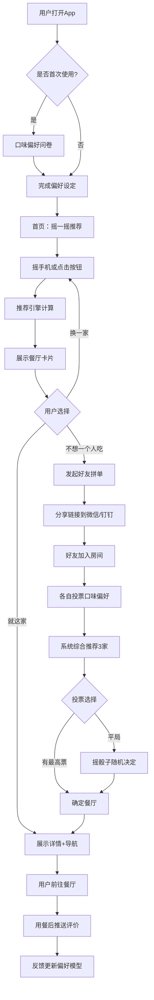
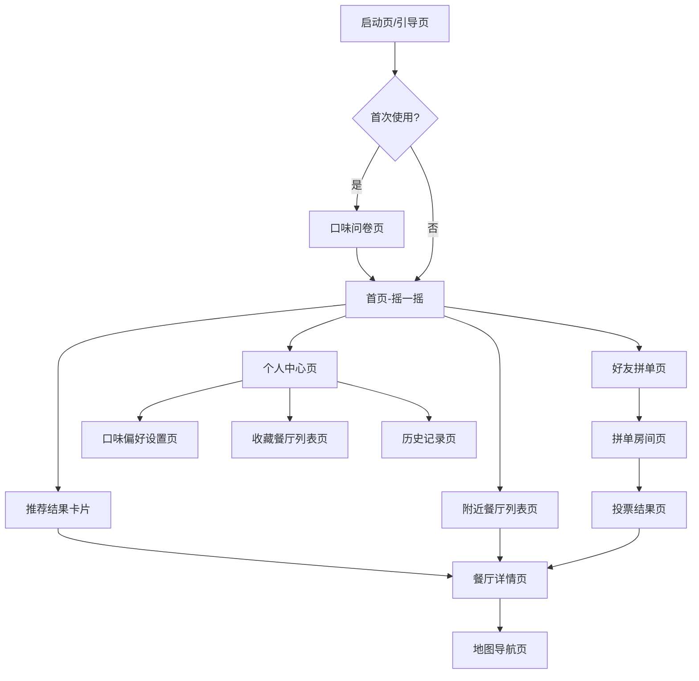

# 今天吃啥美食推荐App功能需求文档

---

## 一、文档概述

### 1.1 评审/修订日志

| 日期 | 修订版本 | 修改描述 | 涉及影响模块 | 作者 | 备注 |
|------|---------|---------|-------------|------|------|
| 2026-03-28 | v1.0 | 初稿创建 | 推荐引擎、口味偏好、附近餐厅、好友拼单 | AI_PM | 样例文档 |

---

## 二、需求分析

### 2.1 需求背景

**需求来源**：市场洞察 - 都市上班族午餐决策痛点

**目标人群及场景**：
- 目标用户：25-35 岁一二线城市上班族，日均外出就餐 1-2 次，月餐饮消费 1500-3000 元
- 使用场景：工作日午餐选择、周末聚餐找店、同事拼单点外卖、探索新口味
- 核心痛点：每天中午"吃什么"决策耗时 10-20 分钟，翻遍外卖 App 仍然选不出来

**需求影响范围**：
- 用户规模：首期目标一线城市核心商圈，覆盖 50 万活跃用户
- 覆盖场景：午餐决策、下午茶推荐、晚餐聚会选址
- 业务价值：通过降低用户决策成本建立使用习惯，后期通过餐厅引流和拼单手续费实现商业化

**需求痛点**（引用需求分析报告）：
1. 大众点评/美团信息过载，筛选条件复杂，反而加剧选择困难（调研中 72% 用户反馈）
2. 每天吃来吃去就那几家，想尝试新餐厅但怕踩雷，缺乏个性化的"替你做主"体验
3. 同事之间午餐协调靠微信群，口味众口难调，经常争论 15 分钟也没结果
4. 有忌口或饮食偏好的用户（如不吃辣、低卡需求），现有平台的筛选不够精细

### 2.2 需求价值

**定性描述**：
「今天吃啥」定位为"帮你做决定"的轻量美食推荐工具，核心价值是在 3 秒内给出一个靠谱的吃饭建议。不同于传统餐饮平台的"信息聚合"思路，我们用"摇一摇"的趣味交互替代繁琐的搜索筛选，通过持续学习用户口味偏好提供越来越准的个性化推荐。好友拼单功能解决了多人就餐场景下的协调难题，为产品带来社交传播属性。

**定量指标**：

| 指标类型 | 指标名称 | 目标值 | 验收标准 |
|---------|---------|-------|---------|
| 效率指标 | 午餐决策时长 | 从打开到选定 ≤ 30 秒 | 上线 1 个月后埋点统计 |
| 体验指标 | 推荐满意度 | 推荐被采纳率 ≥ 40% | 用户点击"就这家"的比例 |
| 增长指标 | 次日留存率 | ≥ 45% | 上线 2 周后统计 |
| 增长指标 | 好友邀请率 | ≥ 15% 用户发起拼单 | 上线 1 个月后统计 |

**优先级评估**：P0（推荐引擎和摇一摇是核心差异化体验，决定产品存亡）

---

## 三、功能清单

### 3.1 主要功能说明

| 模块 | 功能 | 子功能 | 描述 | 优先级 | 备注 |
|------|------|--------|------|--------|------|
| 摇一摇推荐 | 推荐触发 | 摇一摇手势 | 用户摇晃手机，App 随机推荐一家餐厅 | P0 | 配合动画和音效 |
| 摇一摇推荐 | 推荐触发 | 点击按钮 | 不方便摇手机时点击屏幕按钮触发推荐 | P0 | 办公室安静场景 |
| 摇一摇推荐 | 推荐结果 | 餐厅卡片 | 展示餐厅名称、评分、人均、距离、推荐菜品 | P0 | 支持左滑换一家 |
| 摇一摇推荐 | 推荐结果 | 快捷操作 | 一键导航、一键收藏、分享给好友 | P0 | - |
| 口味偏好 | 偏好设定 | 初始问卷 | 首次使用时 5 道趣味选择题收集口味偏好 | P0 | 可跳过 |
| 口味偏好 | 偏好设定 | 忌口设置 | 设置不吃的食材（辣、香菜、海鲜等） | P0 | 推荐时严格排除 |
| 口味偏好 | 偏好学习 | 隐式反馈 | 根据用户"采纳/换一家"行为自动调整偏好权重 | P1 | 算法持续优化 |
| 口味偏好 | 偏好学习 | 显式反馈 | 用餐后评价"好吃/一般/踩雷"更新偏好 | P1 | 用餐后 2 小时推送 |
| 附近餐厅 | 地图模式 | 附近发现 | 在地图上展示周边 1km 内的推荐餐厅 | P1 | 接入高德地图 |
| 附近餐厅 | 筛选排序 | 多维筛选 | 按距离、人均、菜系、评分筛选 | P1 | 支持多条件组合 |
| 附近餐厅 | 餐厅详情 | 详情页 | 餐厅信息、菜品图片、用户评价、营业时间 | P1 | 数据接入大众点评 |
| 好友拼单 | 发起拼单 | 创建房间 | 选择午餐/晚餐场景，设定人数和预算范围 | P1 | 分享链接入群 |
| 好友拼单 | 参与投票 | 口味投票 | 参与者各自选择想吃的菜系，系统综合推荐 | P1 | 取最大公约数 |
| 好友拼单 | 推荐结果 | 综合推荐 | 基于所有人偏好生成 3 家推荐餐厅供投票 | P1 | - |
| 好友拼单 | 最终决定 | 随机决定 | 投票平局时摇骰子随机决定 | P2 | 增加趣味性 |

**功能优先级说明**：
- P0：核心功能，必须实现（决定产品核心价值）
- P1：重要功能，建议实现（提升完整体验）
- P2：增值功能，可选实现（锦上添花）

---

## 四、产品流程

### 4.1 业务流程图

**流程说明**：
1. 首次使用引导用户完成口味问卷（5 道趣味选择题），建立初始偏好画像
2. 核心交互是摇一摇，用户每摇一次获得一个推荐结果，不满意可反复摇
3. 推荐引擎综合考虑口味偏好、地理位置、时段、历史行为等多维度因素
4. 好友拼单是平行分支，多人场景下走投票决策流程
5. 用餐后 2 小时推送评价提醒，反馈数据回流到偏好模型持续优化

### 4.2 页面流程图

**页面层级**：
- 一级页面：首页-摇一摇（核心入口，极简界面仅一个大按钮和摇一摇动效）
- 一级页面：附近餐厅列表页（地图+列表双模式，探索周边美食）
- 一级页面：好友拼单页（发起拼单和查看进行中的拼单房间）
- 一级页面：个人中心页（偏好设置、收藏、历史、账号管理）
- 二级页面：餐厅详情页（餐厅完整信息、菜品图片、用户评价）
- 二级页面：拼单房间页（实时投票状态和推荐结果）
- 三级页面：口味偏好设置页（编辑忌口、菜系偏好、预算范围）

**核心页面跳转**：
- 首页 → 摇一摇/点击按钮 → 推荐结果卡片（底部弹出）
- 推荐结果卡片 → 点击"就这家" → 餐厅详情页
- 首页 → 点击"拼单"入口 → 好友拼单页 → 创建房间 → 分享链接

---

## 五、全局说明

### 5.1 名词解释

| 术语 | 解释 | 备注 |
|------|------|------|
| 摇一摇推荐 | 通过手机加速度传感器检测摇晃动作触发推荐 | 灵敏度可在设置中调节 |
| 口味画像 | 系统基于用户偏好和行为数据建立的个性化口味模型 | 持续学习优化 |
| 拼单房间 | 多人共同决策就餐地点的临时协作空间 | 24 小时后自动关闭 |
| 采纳率 | 用户点击"就这家"占总推荐次数的比例 | 核心体验指标 |
| 偏好权重 | 各口味维度在推荐算法中的影响力系数 | 用户不可见 |

### 5.2 公共的交互说明

**弹窗/对话框**：
- 确认弹窗：删除收藏、退出拼单房间等操作需二次确认
- 提示弹窗：首次使用摇一摇功能时的引导提示

**Toast 提示**：
- 成功提示：底部浮现 2 秒自动消失，如"已收藏"、"已分享"
- 错误提示：底部浮现常驻 3 秒，如"定位获取失败，请检查权限"
- 加载提示：推荐计算中展示趣味动画（转盘/筷子旋转），不使用传统 loading 样式

**键盘交互**：
- 无键盘交互（纯移动端 App）

### 5.3 统一异常处理

| 异常类型 | 触发条件 | 处理方式 | 提示文案 |
|---------|---------|---------|---------|
| 网络异常 | 无网络或请求超时 | 展示离线缓存的上次推荐结果 + 重试按钮 | "网络开小差了，先看看上次的推荐吧" |
| 定位异常 | GPS 权限未授予或定位失败 | 引导开启定位权限，提供手动输入地址入口 | "开启定位后推荐更精准哦" |
| 权限异常 | 摇一摇权限（加速度传感器）未授予 | 降级为点击按钮触发，引导开启运动权限 | "允许运动权限才能摇一摇，也可以直接点按钮" |
| 数据异常 | 附近无可推荐餐厅（如偏远地区） | 展示空状态插画 + 扩大搜索范围建议 | "附近没找到合适的店，试试扩大范围？" |
| 服务异常 | 推荐引擎响应超时 | 使用本地缓存的热门餐厅兜底 | "推荐正在路上，先看看大家都爱去的" |

### 5.4 列表默认数据、分页

**列表默认规则**：
- 默认排序：附近餐厅按综合评分（距离 × 评分加权）排序
- 默认筛选：距离 1km 以内，评分 3.5 以上
- 空状态：插画风格空状态图 + 引导文案"暂时没找到合适的，换个口味试试？"

**分页规则**：
- 分页方式：无限滚动（下拉加载更多）
- 每页数量：10 条
- 加载更多：滑动到底部前 200px 时自动触发预加载，展示骨架屏占位

### 5.5 视觉设计规范

本系统采用**今天吃啥设计系统 v1.0**，确保视觉风格轻松活泼、食欲感满满。

#### 5.5.1 颜色规范

**主色调**：
| 用途 | 色值 | 应用场景 |
|------|------|----------|
| Primary Main | #FF6B35 | 主按钮、Tab 选中态、关键操作 |
| Primary Light | #FFF0E8 | 选中标签背景、轻量提示 |
| Primary Dark | #E55A2B | 按钮按压态 |
| Primary BG | #FFFAF7 | 页面底色 |

**语义色**：
| 类型 | 主色 | 背景色 | 应用场景 |
|------|------|--------|----------|
| 成功 | #22C55E | #F0FDF4 | 收藏成功、拼单完成 |
| 警告 | #F59E0B | #FFFBEB | 餐厅即将打烊、库存紧张 |
| 错误 | #EF4444 | #FEF2F2 | 网络异常、操作失败 |

#### 5.5.2 字体规范

**字体族**：`"PingFang SC", -apple-system, "SF Pro Display", "Helvetica Neue", sans-serif`

**字号规范**：
| 级别 | 字号 | 行高 | 字重 | 应用场景 |
|------|------|------|------|----------|
| H1 | 28px | 1.3 | 700 | 首页"摇一摇"标题 |
| H2 | 22px | 1.4 | 600 | 页面标题 |
| H3 | 18px | 1.4 | 600 | 卡片标题、餐厅名称 |
| Body | 15px | 1.5 | 400 | 正文内容 |
| Caption | 12px | 1.5 | 400 | 距离、人均、辅助信息 |

#### 5.5.3 间距规范

**基础间距**：4px 基数，梯度 4/8/12/16/20/24/32px

**组件间距**：
- 卡片内边距：16px
- 列表项间距：12px
- 底部 Tab 栏高度：56px + 安全区域

#### 5.5.4 圆角与阴影

**圆角规范**：
| 级别 | 值 | 应用场景 |
|------|-----|----------|
| sm | 8px | 小标签、筛选按钮 |
| base | 16px | 餐厅卡片、弹窗 |
| lg | 24px | 底部弹出面板、大按钮 |
| full | 9999px | 头像、圆形图标按钮 |

**阴影规范**：
| 级别 | 值 | 应用场景 |
|------|-----|----------|
| sm | 0 2px 8px rgba(0,0,0,0.08) | 卡片默认态 |
| base | 0 8px 24px rgba(0,0,0,0.12) | 推荐结果弹出卡片 |

#### 5.5.5 组件样式

**按钮样式**：
| 类型 | 背景 | 文字 | 边框 | 悬停/按压 |
|------|------|------|------|------|
| Primary | #FF6B35 | #FFFFFF | 无 | scale(0.96) + #E55A2B |
| Secondary | #FFFFFF | #FF6B35 | 1px solid #FF6B35 | 背景 #FFF0E8 |
| Ghost | 透明 | #6B7280 | 无 | 背景 #F3F4F6 |

#### 5.5.6 布局规范

**页面结构**：
- 顶部状态栏：系统默认，沉浸式处理
- 内容区域：全屏布局，首页以摇一摇大按钮为视觉中心
- 底部 Tab 栏：4 个 Tab（推荐/附近/拼单/我的），56px 高度

**响应式断点**：
- 最小支持：iPhone SE（375×667）
- 推荐尺寸：iPhone 14/15 系列（393×852）

---

## 六、详细功能设计

### 6.1 摇一摇推荐

| 项目 | 说明 |
|------|------|
| **用户场景** | 午休时间到了，小王拿出手机打开「今天吃啥」，摇了一下手机，App 推荐了一家 300 米外新开的川菜馆。看了下评分和人均价格都不错，他点击"就这家"，直接跳转导航 |
| **功能描述** | 用户通过摇晃手机或点击屏幕按钮触发推荐。推荐引擎综合用户口味偏好、当前位置、时段、天气、历史行为等因素，从附近餐厅中选出最匹配的一家。结果以卡片形式从底部弹出，展示餐厅核心信息。用户可左滑换一家，也可点击"就这家"确认选择 |
| **原型图** | [摇一摇推荐原型] 全屏布局，中央一个圆形大按钮带呼吸动效，文案"摇一摇，有惊喜"；底部弹出卡片展示餐厅照片、名称、评分、人均、距离 |
| **优先级** | P0 |
| **输入/前置条件** | 1. 用户已授予定位权限（未授予时降级为热门推荐） 2. 用户已授予加速度传感器权限（未授予时仅支持点击触发） |
| **需求描述（基本事件流）** | 1. 用户进入首页，看到摇一摇引导动画 2. 用户摇晃手机（加速度阈值 > 15m/s²，持续 300ms），或点击中央按钮 3. 触发后播放转盘旋转动画（800ms），同时请求推荐接口 4. 动画结束后从底部弹出餐厅卡片，展示：餐厅封面图、名称、评分（5 星制）、人均消费、步行距离、推荐理由标签（如"符合你的辣度偏好"） 5. 用户左滑卡片换一家，右滑收藏，向上滑动打开详情 6. 用户点击"就这家"按钮，展示导航入口和分享入口 7. 系统记录本次推荐结果和用户行为（采纳/跳过），回传偏好模型 |
| **输出/后置条件** | 1. 推荐记录写入用户历史，不重复推荐最近 3 天内已推荐过的餐厅 2. 用户行为数据回流偏好模型，下次推荐更精准 3. 采纳操作触发用餐后评价提醒的定时任务（2 小时后推送） |
| **用户权限** | 所有已登录用户均可使用，未登录用户可体验 3 次后引导注册 |
| **补充说明** | 每日首次摇一摇有彩蛋动画（如食物表情雨），增加仪式感；安静模式下可关闭摇一摇音效 |

### 6.2 口味偏好学习

| 项目 | 说明 |
|------|------|
| **用户场景** | 小李第一次使用 App，系统弹出 5 道趣味问题："火锅和烧烤只能选一个？""辣度承受力是？"。完成后系统告诉她"你是川菜爱好者，偏爱重口味"。用了一周后，她发现推荐越来越准，因为系统根据她每次的选择在悄悄调整 |
| **功能描述** | 通过初始问卷和持续行为学习两种方式构建用户口味画像。初始问卷以趣味二选一形式收集基础偏好（菜系、辣度、甜咸、价格敏感度）。日常使用中，系统根据"采纳/跳过/评价"等行为隐式更新偏好权重。用户也可以在设置中主动编辑偏好和忌口 |
| **原型图** | [口味问卷原型] 全屏沉浸式卡片，每张卡片一道选择题，左右滑动选择，底部进度条；[偏好设置原型] 标签墙式布局，菜系/口味/忌口分组展示，已选标签高亮 |
| **优先级** | P0 |
| **输入/前置条件** | 1. 用户已完成注册登录 2. 初始问卷在首次使用时触发，后续可在设置中重新填写 |
| **需求描述（基本事件流）** | 1. 首次使用 App，完成注册后进入口味问卷页 2. 依次展示 5 道选择题：①最爱菜系（可多选 3 个）②辣度偏好（不辣/微辣/中辣/重辣）③口味倾向（偏咸/偏甜/都行）④人均预算（15 以下/15-30/30-60/60+）⑤用餐偏好（快餐效率/环境优先/尝鲜冒险） 3. 每道题以趣味图片 + 文案呈现，用户点击选项后自动滑到下一题 4. 完成后展示口味画像总结页（如"无辣不欢的川菜铁粉"） 5. 日常使用中，每次"采纳"某家餐厅，对应菜系权重 +2；"跳过"则 -1 6. 用餐后评价"好吃"权重 +3，"踩雷"权重 -5 并加入负面标记 7. 用户可随时在个人中心-口味设置中查看和手动调整偏好 |
| **输出/后置条件** | 1. 口味画像数据存储在云端，换设备登录后自动同步 2. 偏好权重每日凌晨执行衰减（× 0.99），确保近期行为影响力更大 3. 忌口数据与推荐引擎硬绑定，忌口食材相关的餐厅绝对不推荐 |
| **用户权限** | 所有已登录用户均可使用偏好设置 |
| **补充说明** | 口味画像支持导出分享图片（趣味雷达图），增加社交传播 |

### 6.3 好友拼单

| 项目 | 说明 |
|------|------|
| **用户场景** | 午休前，小张在部门群里说"中午一起吃"，5 个同事响应。小张打开「今天吃啥」发起拼单，分享链接到微信群。每个人打开链接投票自己想吃的菜系，系统综合所有人的偏好推荐了 3 家餐厅。大家投票后选定一家湘菜馆，小张点击导航带队出发 |
| **功能描述** | 支持用户创建拼单房间并分享给好友，多人在线投票口味偏好，系统综合所有人的偏好和位置数据推荐最佳餐厅。房间内实时展示投票状态和推荐结果，支持投票修改和最终确认。投票平局时提供趣味摇骰子功能打破僵局 |
| **原型图** | [拼单房间原型] 顶部显示房间信息（发起人、人数、状态），中部展示参与者头像和投票状态，下部展示推荐结果卡片列表，底部操作栏含"投票""确认""摇骰子"按钮 |
| **优先级** | P1 |
| **输入/前置条件** | 1. 发起人已登录 App 2. 参与者可通过链接免登录参与（微信授权获取昵称和头像） 3. 所有参与者需授予定位权限以计算最佳位置 |
| **需求描述（基本事件流）** | 1. 用户点击底部 Tab"拼单"进入拼单页，点击"发起拼单" 2. 设置拼单信息：用餐时间（午餐/晚餐）、参与人数上限（2-10 人）、人均预算范围 3. 生成拼单房间，系统生成分享链接和小程序码 4. 用户分享到微信群/钉钉群，好友点击链接加入房间 5. 每个参与者选择自己想吃的菜系（最多选 3 个），点击"提交投票" 6. 所有人投票完成后（或发起人点击"截止投票"），系统计算综合偏好 7. 系统推荐 3 家餐厅，每家展示匹配度百分比和距离所有人的平均距离 8. 参与者对 3 家餐厅投票，得票最高的标记为"已选定" 9. 发起人点击"就去这家"确认最终选择，房间内所有人收到通知 |
| **输出/后置条件** | 1. 拼单结果保存在所有参与者的历史记录中 2. 房间 24 小时后自动关闭并归档 3. 参与者的投票数据回流到各自的偏好模型 |
| **用户权限** | 已登录用户可发起拼单；未注册用户可通过链接参与投票（微信授权），但引导注册后才能发起 |
| **补充说明** | 拼单房间支持文字聊天（轻量级），方便讨论；历史拼单可一键"再来一次"快速复用 |

---

## 七、效果验证

### 7.1 指标及定义

**核心监控指标**：

| 指标分类 | 指标名称 | 指标定义 | 计算方式 | 目标值 |
|---------|---------|---------|---------|-------|
| 效率指标 | 决策时长 | 从打开 App 到点击"就这家"的平均时间 | SUM(确认时间 - 打开时间) / 总会话数 | ≤ 30 秒 |
| 效率指标 | 平均摇动次数 | 每次使用平均摇了几次才确认 | 总摇动次数 / 总采纳次数 | ≤ 3 次 |
| 体验指标 | 推荐采纳率 | 用户点击"就这家"的比例 | 采纳次数 / 推荐展示次数 × 100% | ≥ 40% |
| 增长指标 | 次日留存率 | 次日回访用户占比 | 次日活跃用户 / 新增用户 × 100% | ≥ 45% |
| 增长指标 | 拼单发起率 | 活跃用户中发起拼单的比例 | 发起拼单用户数 / DAU × 100% | ≥ 15% |
| 满意度指标 | 用餐后好评率 | 用餐后评价为"好吃"的比例 | 好评数 / 总评价数 × 100% | ≥ 70% |

**监控目的**：
- 决策时长和摇动次数衡量核心推荐体验是否达到"帮你做决定"的产品愿景
- 采纳率和好评率验证推荐引擎的精准度是否满足用户期待
- 留存率和拼单率评估产品的长期价值和社交裂变效果

### 7.2 数据埋点

| 埋点事件 | 触发时机 | 事件参数 | 备注 |
|---------|---------|---------|------|
| shake_trigger | 摇一摇或点击按钮触发推荐 | trigger_type(shake/click), location, time_of_day | 区分触发方式 |
| recommend_show | 推荐卡片展示 | restaurant_id, match_score, distance, cuisine | 推荐曝光统计 |
| recommend_adopt | 点击"就这家" | restaurant_id, shake_count, decision_seconds | 核心转化事件 |
| recommend_skip | 左滑换一家 | restaurant_id, skip_reason_tag | 分析跳过原因 |
| preference_init | 完成初始问卷 | cuisine_list, spicy_level, budget_range | 仅首次触发 |
| preference_update | 偏好手动编辑 | changed_fields, before_value, after_value | 偏好变更追踪 |
| group_create | 发起拼单 | member_limit, budget_range, meal_type | 拼单发起 |
| group_join | 加入拼单房间 | room_id, join_source(link/qrcode) | 裂变渠道分析 |
| group_vote | 提交投票 | room_id, voted_cuisines | 投票行为分析 |
| post_meal_rate | 用餐后评价 | restaurant_id, rating(good/ok/bad), hours_after | 推荐质量回溯 |

**埋点规范**：
- 事件命名：小写字母 + 下划线分隔，动作导向命名（如 shake_trigger、recommend_adopt）
- 参数命名：小写字母 + 下划线分隔，含义清晰
- 数据上报：实时上报核心事件（推荐/采纳），非核心事件攒批每 30 秒上报一次

---

## 八、非功能性说明

### 8.1 性能需求

| 性能指标 | 要求 | 说明 |
|---------|------|------|
| App 冷启动 | ≤ 1.5 秒 | 从点击图标到首页可交互 |
| 推荐响应时间 | ≤ 800ms | 从触发到卡片弹出（含动画时间） |
| 定位获取 | ≤ 2 秒 | 使用缓存定位 + 后台精确定位双策略 |
| 内存占用 | ≤ 150MB | 正常使用时的峰值内存 |
| 安装包大小 | ≤ 30MB | 首次下载安装包 |

### 8.2 兼容性需求

**浏览器兼容**：
- 不涉及（原生 App）

**系统兼容**：
- iOS 15+（完整支持，占 60%+）
- Android 10+（完整支持，占 35%+）
- 最低分辨率：375×667（iPhone SE）

**移动端**：
- 本产品为移动端原生 App，iOS 使用 Swift/SwiftUI，Android 使用 Kotlin/Jetpack Compose

### 8.3 安全需求

- **权限控制**：最小权限原则，仅申请定位、加速度传感器权限，明确告知用途
- **数据加密**：用户口味数据和位置数据传输使用 HTTPS/TLS 1.3，本地存储使用 AES-256 加密
- **操作审计**：记录登录日志和敏感操作（如绑定手机号变更），保留 90 天
- **防篡改**：拼单投票结果服务端校验，防止客户端篡改投票数据

### 8.4 未来规划

| 版本 | 规划功能 | 预计时间 | 备注 |
|------|---------|---------|------|
| v1.1 | 外卖一键下单（接入美团/饿了么） | 2026 Q3 | 探索佣金分成模式 |
| v1.2 | AI 菜品识别（拍照识别菜品并评价） | 2026 Q4 | 丰富评价维度 |
| v2.0 | 企业版（公司食堂+周边团餐推荐） | 2027 Q1 | B2B2C 模式 |
| v2.1 | 美食社区（用户分享探店笔记） | 2027 Q2 | UGC 内容建设 |

---

*文档生成时间：2026-03-28 | 生成工具：AI_PM*
*基于：用户调研问卷（500 份回收）、竞品分析（大众点评/饿了么/觅食蜂）、餐饮行业数据报告*
