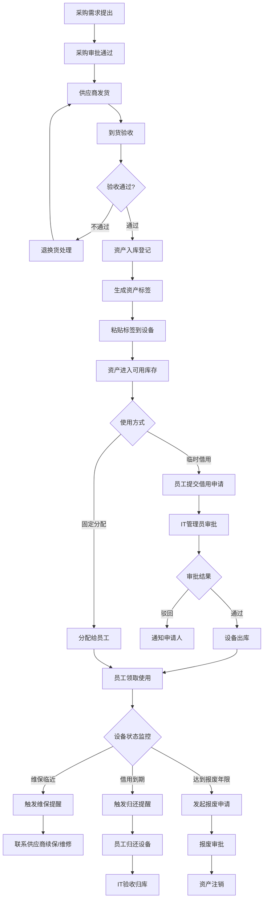
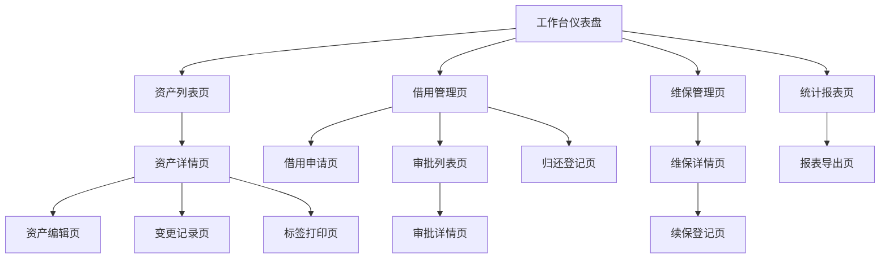

# 效率台IT资产管理系统功能需求文档

---

## 一、文档概述

### 1.1 评审/修订日志

| 日期 | 修订版本 | 修改描述 | 涉及影响模块 | 作者 | 备注 |
|------|---------|---------|-------------|------|------|
| 2026-03-28 | v1.0 | 初稿创建 | 资产登记、借用归还、维保提醒、统计报表 | AI_PM | 样例文档 |

---

## 二、需求分析

### 2.1 需求背景

**需求来源**：内部需求 - IT 运维部门资产管理数字化

**目标人群及场景**：
- 目标用户：IT 运维部门（5-20 人）的资产管理员、IT 主管和普通员工（资产借用人）
- 使用场景：新设备入库登记、员工入职设备领用、设备借用归还、维保到期处理、年度资产盘点
- 核心痛点：Excel 管资产，台账和实物经常对不上，设备在谁手里要问一圈才知道

**需求影响范围**：
- 用户规模：IT 部门 10 人日常使用，全公司 500 人涉及资产借用自助操作
- 覆盖场景：IT 资产全生命周期管理（采购→入库→使用→维保→报废）
- 业务价值：资产台账准确率从 70% 提升至 98%，盘点效率提升 80%

**需求痛点**（引用需求分析报告）：
1. Excel 台账与实物脱节严重，上次盘点发现 23% 的资产信息有误（使用人不对、状态过期、序列号缺失）
2. 设备维保到期无人跟踪，上季度有 3 台服务器过保后才发现，紧急续保多花了 40% 费用
3. 员工离职时设备回收靠人工核查，经常遗漏，去年有 5 台笔记本随离职员工流失
4. 领导要资产数据时，IT 需要花半天从 Excel 里手动汇总，数据时效性差

### 2.2 需求价值

**定性描述**：
「效率台」IT 资产管理系统将替代 Excel 台账，为 IT 运维部门提供资产全生命周期的数字化管理能力。通过条码/二维码标签实现资产快速识别，通过审批流程规范借用归还操作，通过自动化提醒消除维保遗忘风险，通过实时报表为管理层提供数据支撑。目标是让 IT 部门从"被动响应"转变为"主动管控"。

**定量指标**：

| 指标类型 | 指标名称 | 目标值 | 验收标准 |
|---------|---------|-------|---------|
| 效率指标 | 资产盘点耗时 | 从 3 天缩短至 4 小时 | 首次系统盘点完成后统计 |
| 效率指标 | 入库登记时间 | 单台设备 ≤ 2 分钟 | 上线 1 个月后统计平均值 |
| 体验指标 | 资产台账准确率 | ≥ 98% | 上线 3 个月后盘点对比 |
| 业务指标 | 维保过期率 | 降至 0% | 上线 6 个月内无过保设备 |

**优先级评估**：P0（资产管理是 IT 运维基础能力，直接影响公司资产安全和运维效率）

---

## 三、功能清单

### 3.1 主要功能说明

| 模块 | 功能 | 子功能 | 描述 | 优先级 | 备注 |
|------|------|--------|------|--------|------|
| 资产登记 | 新增资产 | 手动录入 | 填写资产基本信息（名称、型号、序列号、供应商等） | P0 | - |
| 资产登记 | 新增资产 | 批量导入 | Excel 批量导入历史资产数据 | P0 | 提供模板下载 |
| 资产登记 | 新增资产 | 扫码录入 | 扫描设备条码自动填充品牌型号信息 | P1 | 需维护品牌库 |
| 资产登记 | 资产标签 | 标签生成 | 自动生成资产二维码标签用于打印粘贴 | P0 | 含资产编号+二维码 |
| 资产登记 | 资产变更 | 信息编辑 | 修改资产基本信息，变更记录留痕 | P0 | - |
| 资产登记 | 资产查询 | 高级搜索 | 按类型、状态、使用人、部门等多维度搜索 | P0 | 支持模糊搜索 |
| 借用归还 | 借用申请 | 员工申请 | 员工提交设备借用申请，填写用途和预计归还日期 | P0 | 全员可见 |
| 借用归还 | 借用审批 | IT 审批 | IT 管理员审批借用申请，确认设备可用性 | P0 | 支持批量审批 |
| 借用归还 | 设备归还 | 归还登记 | 扫码归还，IT 管理员验收设备状态 | P0 | 记录设备完好度 |
| 借用归还 | 逾期处理 | 逾期提醒 | 超过预计归还日期自动发送提醒通知 | P0 | 邮件+企微通知 |
| 维保提醒 | 维保录入 | 合同登记 | 录入维保合同信息（供应商、起止日期、服务内容） | P0 | - |
| 维保提醒 | 到期提醒 | 自动提醒 | 维保到期前 30/15/7 天分级提醒 | P0 | 通知 IT 主管 |
| 维保提醒 | 续保管理 | 续保记录 | 记录续保操作和新合同信息 | P1 | 关联历史合同 |
| 统计报表 | 资产总览 | 仪表盘 | 展示资产总量、类型分布、状态分布、部门分布 | P0 | 实时更新 |
| 统计报表 | 明细报表 | 导出报表 | 按条件导出资产明细 Excel/PDF | P1 | 支持自定义列 |
| 统计报表 | 趋势分析 | 变化趋势 | 资产增减、借用频次、维保费用的月度趋势图 | P2 | - |

**功能优先级说明**：
- P0：核心功能，必须实现（决定产品核心价值）
- P1：重要功能，建议实现（提升完整体验）
- P2：增值功能，可选实现（锦上添花）

---

## 四、产品流程

### 4.1 业务流程图

**流程说明**：
1. 采购到货后，IT 管理员进行验收，通过后在系统中登记资产信息并生成标签
2. 资产入库后进入可用库存，可通过固定分配（如新员工入职配发）或临时借用两种方式出库
3. 临时借用需走审批流程，审批通过后设备出库，系统自动跟踪归还期限
4. 使用期间系统持续监控三类事件：维保到期、借用逾期、报废年限
5. 维保到期前自动分级提醒，避免过保风险
6. 设备达到使用年限或无法维修时，走报废审批流程注销资产

### 4.2 页面流程图

**页面层级**：
- 一级页面：工作台仪表盘（IT 管理员首页，展示关键指标和待办事项）
- 一级页面：资产列表页（所有资产的查询、筛选和批量操作）
- 一级页面：借用管理页（借用申请列表、待审批列表、归还登记）
- 一级页面：维保管理页（维保合同列表、到期日历、续保记录）
- 一级页面：统计报表页（资产总览仪表盘和各类明细报表）
- 二级页面：资产详情页（单个资产的全部信息和操作历史）
- 二级页面：审批详情页（借用申请的审批操作页）
- 三级页面：标签打印页（选择标签模板并预览打印）

**核心页面跳转**：
- 工作台 → 点击"待审批"卡片 → 审批列表页
- 工作台 → 点击"即将过保"卡片 → 维保管理页（筛选即将过保）
- 资产列表页 → 点击某行资产 → 资产详情页 → 点击"打印标签" → 标签打印页

---

## 五、全局说明

### 5.1 名词解释

| 术语 | 解释 | 备注 |
|------|------|------|
| 资产编号 | 系统自动生成的唯一标识，格式 IT-{类型缩写}-{年份}-{序号} | 如 IT-NB-2026-0042 |
| 固定分配 | 设备长期分配给某员工使用，跟随员工直到离职或更换 | 与临时借用区分 |
| 临时借用 | 设备短期借出使用，有明确归还期限 | 需审批 |
| 维保合同 | 与供应商签订的设备维护保修服务协议 | 含服务期限和SLA |
| 资产盘点 | 定期核对系统台账与实物资产的一致性 | 通常年度或半年度 |
| 报废年限 | 资产按公司财务制度规定的折旧年限 | 笔记本 3 年，服务器 5 年 |

### 5.2 公共的交互说明

**弹窗/对话框**：
- 确认弹窗：删除资产、报废操作等不可逆操作需二次确认，明确说明后果
- 提示弹窗：审批操作（通过/驳回）前确认，驳回时必须填写原因

**Toast 提示**：
- 成功提示：右上角显示 3 秒，如"资产入库成功，编号：IT-NB-2026-0042"
- 错误提示：红色文案常驻至手动关闭，如"序列号已存在，请核实后重新录入"
- 加载提示：操作耗时超过 500ms 显示加载动画，如"正在生成标签…"

**键盘交互**：
- `Ctrl/Cmd + N`：新建资产（资产列表页）/ 新建申请（借用管理页）
- `Ctrl/Cmd + F`：聚焦搜索框
- `Ctrl/Cmd + P`：打印标签（资产详情页）
- `Esc`：关闭弹窗

### 5.3 统一异常处理

| 异常类型 | 触发条件 | 处理方式 | 提示文案 |
|---------|---------|---------|---------|
| 网络异常 | 请求超时或断网 | 本地缓存数据可查看，写操作排队，网络恢复后同步 | "网络不太稳定，数据会在恢复后自动同步" |
| 服务异常 | 服务端返回 500 错误 | 显示错误页面，提供刷新按钮和运维联系方式 | "系统开小差了，请刷新重试或联系运维" |
| 权限异常 | 非 IT 人员访问管理功能 | 隐藏无权限菜单，直接访问URL时跳转403页面 | "该功能需要 IT 管理员权限" |
| 数据异常 | 必填字段为空或格式错误 | 字段标红并显示错误说明 | "请检查标红字段，{字段名}格式不正确" |
| 并发冲突 | 两人同时编辑同一资产 | 后保存者提示冲突，显示差异让用户选择 | "该资产刚被其他人修改，请确认是否覆盖" |

### 5.4 列表默认数据、分页

**列表默认规则**：
- 默认排序：资产列表按入库时间倒序，借用列表按申请时间倒序
- 默认筛选：资产列表默认显示"在用"和"闲置"状态，隐藏已报废资产
- 空状态：显示引导图标 + 操作指引，如"还没有资产记录，点击'新增'开始录入"

**分页规则**：
- 分页方式：传统分页（底部页码导航）
- 每页数量：50 条（资产管理场景数据量大，默认多展示）
- 加载更多：点击页码跳转，支持跳转到指定页码

### 5.5 视觉设计规范

本系统采用**效率台设计系统 v1.0**，风格简洁专业，强调信息密度和操作效率。

#### 5.5.1 颜色规范

**主色调**：
| 用途 | 色值 | 应用场景 |
|------|------|----------|
| Primary Main | #4F46E5 | 主按钮、导航选中态、关键链接 |
| Primary Light | #E0E7FF | 选中行背景、标签底色 |
| Primary Dark | #3730A3 | 按钮 hover 态 |
| Primary BG | #F5F3FF | 页面辅助区域背景 |

**语义色**：
| 类型 | 主色 | 背景色 | 应用场景 |
|------|------|--------|----------|
| 成功 | #059669 | #ECFDF5 | 入库成功、审批通过、设备正常 |
| 警告 | #D97706 | #FFFBEB | 维保即将到期、借用即将逾期 |
| 错误 | #DC2626 | #FEF2F2 | 维保已过期、借用已逾期、设备故障 |

#### 5.5.2 字体规范

**字体族**：`"PingFang SC", -apple-system, BlinkMacSystemFont, "Segoe UI", Roboto, "Helvetica Neue", sans-serif`

**字号规范**：
| 级别 | 字号 | 行高 | 字重 | 应用场景 |
|------|------|------|------|----------|
| H1 | 22px | 1.4 | 600 | 页面标题 |
| H2 | 18px | 1.4 | 600 | 模块标题、卡片标题 |
| H3 | 15px | 1.5 | 500 | 表格列标题 |
| Body | 14px | 1.5 | 400 | 正文、表格内容 |
| Caption | 12px | 1.5 | 400 | 辅助说明、时间戳、编号 |

#### 5.5.3 间距规范

**基础间距**：4px 基数，梯度 4/8/12/16/20/24/32px

**组件间距**：
- 卡片内边距：16px
- 表单控件间距：12px
- 表格行高：48px

#### 5.5.4 圆角与阴影

**圆角规范**：
| 级别 | 值 | 应用场景 |
|------|-----|----------|
| sm | 4px | 输入框、小按钮、标签 |
| base | 6px | 卡片、弹窗、下拉菜单 |
| lg | 8px | 统计卡片、大面积容器 |

**阴影规范**：
| 级别 | 值 | 应用场景 |
|------|-----|----------|
| sm | 0 1px 3px rgba(0,0,0,0.06) | 卡片默认态 |
| base | 0 4px 12px rgba(0,0,0,0.08) | 弹窗、浮层 |

#### 5.5.5 组件样式

**按钮样式**：
| 类型 | 背景 | 文字 | 边框 | 悬停 |
|------|------|------|------|------|
| Primary | #4F46E5 | #FFFFFF | 无 | #3730A3 |
| Secondary | #FFFFFF | #4F46E5 | 1px solid #C7D2FE | 背景 #E0E7FF |
| Danger | #DC2626 | #FFFFFF | 无 | #B91C1C |
| Ghost | 透明 | #6B7280 | 无 | 背景 #F3F4F6 |

#### 5.5.6 布局规范

**页面结构**：
- 顶部导航栏：高度 48px，固定定位，包含系统名称、全局搜索、通知铃铛、用户信息
- 左侧导航栏：宽度 200px，可折叠至 56px，包含功能模块导航
- 内容区域：自适应宽度，内边距 20px，表格宽度 100% 铺满

**响应式断点**：
- 最小支持：1366×768（内部系统最低标准）
- 推荐尺寸：1920×1080

---

## 六、详细功能设计

### 6.1 资产登记与标签管理

| 项目 | 说明 |
|------|------|
| **用户场景** | 本月公司采购了 20 台新笔记本电脑，IT 管理员老陈需要逐台录入系统并打印标签粘贴到设备上，以便后续扫码管理 |
| **功能描述** | 支持手动录入、批量导入和扫码录入三种方式登记资产。录入时自动生成唯一资产编号，并可一键生成包含编号和二维码的资产标签。标签支持多种尺寸模板，可批量打印。资产信息变更自动记录变更日志，确保全程可追溯 |
| **原型图** | [资产登记原型] 左侧资产分类树 + 右侧表单布局，表单分为基本信息、采购信息、维保信息三个折叠区域；[标签打印原型] 左侧标签预览 + 右侧打印设置 |
| **优先级** | P0 |
| **输入/前置条件** | 1. 用户已登录且具有"资产管理"权限 2. 资产分类和品牌库已初始化（系统预置常见类型） |
| **需求描述（基本事件流）** | 1. IT 管理员进入资产列表页，点击"新增资产"按钮 2. 选择资产类型（笔记本/台式机/显示器/服务器/网络设备/外设/其他） 3. 填写基本信息：资产名称、品牌、型号、序列号、颜色、规格配置 4. 填写采购信息：采购日期、供应商、采购金额、发票编号 5. 填写维保信息：维保起止日期、维保供应商、服务等级 6. 点击"保存"，系统校验序列号唯一性，生成资产编号 7. 保存成功后弹出"是否立即打印标签"提示 8. 点击"打印标签"，选择标签尺寸模板（40×20mm/60×30mm），预览后发送到打印机 9. 批量导入场景：下载 Excel 模板 → 填写数据 → 上传文件 → 系统校验 → 展示校验结果 → 确认导入 |
| **输出/后置条件** | 1. 新资产生成唯一编号，初始状态为"闲置" 2. 入库操作记入变更日志（操作人、操作时间、操作类型） 3. 标签打印后资产标记"已贴标" |
| **用户权限** | IT 管理员：新增、编辑、删除资产，打印标签；IT 主管：全部权限 + 批量导入和报废审批；普通员工：仅查看自己名下的资产 |
| **补充说明** | 资产编号规则：IT-{类型缩写2位}-{年份4位}-{4位自增序号}，如 IT-NB-2026-0001（NB=笔记本，DT=台式机，MN=显示器，SV=服务器） |

### 6.2 借用审批与归还

| 项目 | 说明 |
|------|------|
| **用户场景** | 市场部小王下周要出差做路演，需要借一台投影仪和一根转接线。他在系统中提交借用申请，IT 管理员老陈收到通知后审批通过，小王到 IT 部领取设备。出差结束后小王归还设备，老陈扫码验收入库 |
| **功能描述** | 员工可在线提交设备借用申请，说明借用用途和预计归还日期。IT 管理员在审批列表中处理申请，审批通过后系统自动将设备状态变更为"借出"。借用到期前系统自动提醒归还，逾期后升级通知给借用人直属主管。归还时 IT 管理员扫码验收设备状态后完成入库 |
| **原型图** | [借用申请原型] 表单页面，含设备选择器（支持搜索闲置设备）、借用原因文本框、预计归还日期选择器；[归还登记原型] 扫码输入框 + 设备状态选择（完好/有损/故障） |
| **优先级** | P0 |
| **输入/前置条件** | 1. 借用人已登录系统（全员可申请） 2. 目标设备状态为"闲置"（已借出设备不可重复借用） 3. IT 管理员已登录且具有审批权限 |
| **需求描述（基本事件流）** | 1. 员工进入借用管理页，点击"申请借用" 2. 在设备选择器中搜索目标设备（支持按类型、品牌筛选，仅展示闲置设备） 3. 填写借用原因、预计归还日期（最长 30 天） 4. 提交申请，系统推送通知给 IT 管理员 5. IT 管理员在审批列表中查看申请详情，点击"通过"或"驳回" 6. 审批通过后，设备状态自动变更为"借出"，借用人收到通过通知 7. 借用人到 IT 部领取设备，管理员扫码确认出库 8. 归还日前 3 天，系统自动发送归还提醒 9. 借用人归还设备，管理员扫描资产二维码 10. 管理员选择设备状态（完好/有损/故障），填写验收备注 11. 确认归还，设备状态恢复为"闲置"或转为"维修中" |
| **输出/后置条件** | 1. 借用全过程生成完整操作日志（申请→审批→出库→提醒→归还→验收） 2. 归还后设备恢复可借用状态 3. 逾期记录纳入员工借用信用档案，信用差者后续借用需额外审批 |
| **用户权限** | 普通员工：提交借用申请、查看自己的申请记录；IT 管理员：审批、出库确认、归还验收；IT 主管：查看全部借用记录、处理逾期升级 |
| **补充说明** | 员工离职时，HR 系统联动触发资产回收流程，自动生成该员工名下所有设备的归还清单 |

### 6.3 维保到期提醒

| 项目 | 说明 |
|------|------|
| **用户场景** | 公司有 50 台服务器分布在 3 个机房，维保合同分属 4 家供应商，到期时间各不相同。IT 主管老李希望系统在维保到期前自动提醒，避免过保风险。他还需要一眼看到未来 3 个月内所有即将到期的维保合同，提前做预算规划 |
| **功能描述** | 支持为每个资产录入维保合同信息（供应商、服务期限、服务内容、续保费用预估）。系统自动根据维保到期日进行分级提醒：到期前 30 天发送初次提醒，15 天发送二次提醒，7 天发送紧急提醒。提供维保日历视图，直观展示未来的到期时间分布。支持续保记录管理，关联历史合同 |
| **原型图** | [维保日历原型] 月历视图，不同颜色标记到期紧急度（绿色>30天、黄色15-30天、红色<15天）；点击日期弹出当天到期资产列表 |
| **优先级** | P0 |
| **输入/前置条件** | 1. 资产已登记入库 2. 维保合同信息已录入（维保起止日期为必填字段） |
| **需求描述（基本事件流）** | 1. IT 管理员在资产详情页的"维保信息"区域录入合同信息 2. 填写维保供应商、合同编号、服务起始日期、服务结束日期、服务内容描述、年费金额 3. 保存后系统自动计算剩余天数并设置提醒任务 4. 到期前 30 天：系统发送邮件+站内信给 IT 管理员，标题"维保到期提醒（30 天）" 5. 到期前 15 天：发送二次提醒给 IT 管理员和 IT 主管 6. 到期前 7 天：发送紧急提醒给 IT 主管，邮件标题标红 7. IT 主管进入维保管理页，查看"即将到期"标签页，批量查看所有即将到期的合同 8. 确认续保后，IT 管理员在资产详情页点击"续保"，录入新合同信息 9. 续保完成后旧合同标记为"已续保"，新合同生效 |
| **输出/后置条件** | 1. 每次提醒发送后记录发送日志（时间、渠道、接收人、是否成功） 2. 续保后新合同与旧合同关联，可查看完整维保历史 3. 每月自动生成维保费用统计，供 IT 主管做预算参考 |
| **用户权限** | IT 管理员：录入和编辑维保信息、执行续保操作；IT 主管：查看全部维保信息、接收提醒、审批续保预算；普通员工：不可见维保信息 |
| **补充说明** | 维保日历支持导出 iCal 格式，可同步到个人日历 App（如 Outlook、Google Calendar）方便日常查看 |

---

## 七、效果验证

### 7.1 指标及定义

**核心监控指标**：

| 指标分类 | 指标名称 | 指标定义 | 计算方式 | 目标值 |
|---------|---------|---------|---------|-------|
| 效率指标 | 资产入库耗时 | 单台设备从开始录入到完成入库的平均时间 | SUM(入库时间 - 开始录入时间) / 入库资产数 | ≤ 2 分钟 |
| 效率指标 | 借用审批时效 | 从申请提交到审批完成的平均时间 | SUM(审批时间 - 申请时间) / 申请总数 | ≤ 2 小时 |
| 体验指标 | 台账准确率 | 系统台账与实物盘点的一致率 | 一致资产数 / 总资产数 × 100% | ≥ 98% |
| 体验指标 | 系统覆盖率 | 已纳入系统管理的资产占全部资产的比例 | 系统资产数 / 实际资产总数 × 100% | 100% |
| 满意度指标 | IT 部门满意度 | IT 团队对系统的满意度评分 | 季度问卷平均分（5 分制） | ≥ 4.2 |
| 业务指标 | 维保过期率 | 维保过期未续保的资产占比 | 过期资产数 / 有维保资产数 × 100% | 0% |

**监控目的**：
- 效率指标衡量系统是否真正替代了 Excel 并提升了工作效率
- 台账准确率是核心业务指标，直接反映系统价值
- 维保过期率为零是硬性目标，任何过保都意味着提醒机制失效

### 7.2 数据埋点

| 埋点事件 | 触发时机 | 事件参数 | 备注 |
|---------|---------|---------|------|
| asset_create | 新建资产保存成功 | asset_type, create_method(manual/import/scan), duration_seconds | 区分创建方式 |
| asset_import | 批量导入完成 | total_count, success_count, fail_count, duration_seconds | 导入成功率 |
| label_print | 打印资产标签 | asset_id, label_size, printer_type | 标签使用频率 |
| borrow_apply | 提交借用申请 | asset_id, applicant_dept, borrow_days | 借用需求分析 |
| borrow_approve | 审批借用申请 | application_id, result(approve/reject), duration_minutes | 审批时效 |
| borrow_return | 归还设备验收 | asset_id, condition(good/damaged/broken), overdue_days | 设备折损率 |
| warranty_alert | 维保提醒发送 | asset_id, days_remaining, alert_level(30/15/7), channel | 提醒触达率 |
| warranty_renew | 维保续保完成 | asset_id, vendor, annual_cost, renew_before_expire(bool) | 续保及时性 |
| report_export | 导出报表 | report_type, filter_params, format(excel/pdf) | 报表使用频率 |

**埋点规范**：
- 事件命名：小写字母 + 下划线分隔，模块_动作格式（如 asset_create、borrow_apply）
- 参数命名：小写字母 + 下划线分隔，含义明确
- 数据上报：实时上报至内部数据平台，每日凌晨生成汇总报表

---

## 八、非功能性说明

### 8.1 性能需求

| 性能指标 | 要求 | 说明 |
|---------|------|------|
| 首屏加载时间 | ≤ 2 秒 | 工作台仪表盘完整渲染 |
| 接口响应时间 | ≤ 300ms（P95） | 内网部署，性能要求更高 |
| 并发用户数 | 支持 50 人同时在线 | IT 部门 + 同时提交借用的员工 |
| 系统可用性 | 99.5%（月度） | 内部系统要求适度降低 |
| 报表生成 | ≤ 5 秒 | 1 万条资产数据的统计报表 |

### 8.2 兼容性需求

**浏览器兼容**：
- Chrome 90+（完整支持，公司标配浏览器）
- Edge 90+（完整支持，Windows 系统自带）
- Firefox 88+（基本支持，少量用户使用）
- Safari 不做强制兼容（Mac 用户使用 Chrome）

**系统兼容**：
- Windows 10/11（完整支持，占 90%+，公司标配系统）
- macOS 12+（完整支持，占 10%，设计和研发部门使用）
- 最低分辨率：1366×768

**移动端**：
- 员工借用申请和审批操作支持企业微信内嵌 H5 页面，其他管理功能仅 PC 端

### 8.3 安全需求

- **权限控制**：对接公司统一身份认证（SSO），角色权限分为 IT 管理员、IT 主管、普通员工三级，数据按部门隔离
- **数据加密**：内网 HTTPS 部署，数据库敏感字段（采购金额、供应商信息）加密存储
- **操作审计**：所有资产变更操作记录完整审计日志（操作人、操作时间、操作内容、变更前后值），保留 3 年
- **防篡改**：资产编号生成后不可修改，报废记录不可删除，确保财务审计合规

### 8.4 未来规划

| 版本 | 规划功能 | 预计时间 | 备注 |
|------|---------|---------|------|
| v1.1 | RFID 自动盘点（网关自动扫描在库资产） | 2026 Q4 | 需采购 RFID 标签和网关 |
| v1.2 | 企业微信深度集成（审批流+消息推送） | 2026 Q4 | 替代邮件通知 |
| v2.0 | 多分支机构支持（总部-分公司资产调拨） | 2027 Q1 | 跨机构审批流程 |
| v2.1 | 智能预测（资产采购需求预测+预算建议） | 2027 Q2 | 基于历史数据分析 |

---

*文档生成时间：2026-03-28 | 生成工具：AI_PM*
*基于：IT 运维部门需求访谈、现有 Excel 台账分析、ITIL 资产管理最佳实践*
